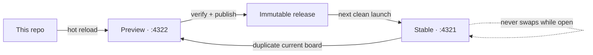

# SystemSketch

SystemSketch starts from one deliberately boring datum: the stock tldraw whiteboard. Its engine, drawing tools, and shortcuts stay stock while narrow supported seams add local files, board overview, zoom, Help, and the Stable/Preview workflow.

## Current improvement review

The [35-item repo improvement review](docs/repo-improvement-review-2026-09-02.html) ranks the audited gaps, shows the top ten already running with real-browser evidence, and gives each shipped fix and remaining candidate its own accept checkbox and review note. The [follow-up decision gallery](docs/repo-improvement-followup-review-2026-09-02.html) covers the revised future-format workflow plus comments, commands, timer removal, diagnostics, and folder creation with one accept checkbox and note field per change. These are temporary decision surfaces; code and ordinary regression tests remain the living specification.

The [Tidy Edges + Organize Nodes comparison](docs/layout-comparison-2026-09-02.html) runs the ported PyBlocks architecture against 40 increasingly messy synthetic cases: 20 edge-channel fixtures and 20 node-layout fixtures, each with an interactive before/after canvas and measured invariants. The companion [`tidy-edges.systemsketch`](sketches/review/tidy-edges.systemsketch) and [`organize-nodes.systemsketch`](sketches/review/organize-nodes.systemsketch) boards are ready for direct human verification.

The [Ctrl+P command-palette implementation gallery](docs/command-palette-ctrl-p-2026-09-02.html) shows the editor-style shortcut opening the real Commands dialog with search focused while suppressing the browser print action. Ctrl+K remains a compatibility alias, Ctrl+F still opens board Find & replace, and the linked review board is ready to drive on the current Preview.

[Open the rendered foundation report](docs/systemsketch-foundation-2026-08-30.html)

## The starting point

- `tldraw@5.3.2`, pinned exactly.
- Stock `<Tldraw>` engine extended through its supported component, shape, and mount seams.
- One local `.systemsketch` document is canonical; autosave and smart reopen survive refreshes, while portable export produces a stock-readable `.tldr`.
- Self-hosted tldraw assets and the SDK license-key seam.
- Release status is tucked into Help instead of occupying the top of the canvas.

## Evolving it safely



- The dock icon always opens Stable.
- Stable serves a content-addressed immutable release and does not swap code underneath an open canvas.
- Preview runs Vite from this checkout and updates live as agents edit React/CSS.
- Preview fingerprints the Python workspace controller at startup; opening Preview after controller edits safely replaces the launcher-owned API/Vite pair so the hot frontend cannot drift onto an old local API.
- **Open Live Preview** snapshots the current board, opens the copy in a new Preview window, and then lets the two browser profiles evolve independently.
- Browser-local images are made portable during that one-time handoff rather than pointing back to Stable's private asset store.
- Stable and Preview use separate ports and browser profiles; when they intentionally point at the same local file, a content-digest fence prevents silent clobbers.
- **Publish Preview** runs type checks, frontend tests, Python release tests, and a production build before advancing the Stable pointer.
- The previous verified Stable build remains available for rollback on the next launch.

## Development operating loop

Product changes close one vertical user behavior at a time: define its observable proof, implement the thinnest path, exercise it in the deployed app, and validate it with a real sketch before starting the next behavior. The [UI development operating loop](docs/ui-development-operating-loop-2026-08-30.html) records the evidence, micro-V model, WIP guardrails, and recommended first slice.

The [review-fixture implementation gallery](docs/systemsketch-review-fixture-2026-09-01.html) adds the human handoff surface to that loop. After a feature is finished, the repo-local skill creates a disposable `.systemsketch` with the real objects already in place, numbered orange gesture cues, a green visible pass condition, and a direct Preview URL. Its helper authors through the current SystemSketch editor, then verifies autosave and a cold reopen instead of hand-maintaining raw tldraw schema JSON.

The [review-fixture legibility loop](docs/review-fixture-legibility-2026-09-02.html) corrects the handoff surface after visual review: cue arrows are stock elbow arrows bound to both the card and the named target edge, cards and same-edge arrow lanes have enforced breathing room, dense text is rejected early, and two reproducible six-board seeds make visual critique part of maintaining the skill rather than a one-off check.

The [development worktree document-link report](docs/development-worktree-paths-2026-09-02.html) makes those direct review URLs work on isolated track servers: Preview explicitly authorizes its own source worktree in addition to `.track/boards`, while Stable, the File browser root, neighboring worktrees, and arbitrary machine paths remain confined. The report opens the reported branch-region fixture in the real branch UI and carries the open → autosave → cold-reopen browser proof.

The [independent feature-labs architecture](docs/independent-feature-labs-2026-08-31.html) recommends one production entry point plus development-only stock-tldraw composition profiles, so each feature can be built and proven without importing volatile product chrome or unrelated features. That boundary is now implemented by the Dev Hub below.

The [worktree-per-track workflow review](docs/worktree-track-workflow-2026-09-01.html) evaluates the proposed "one agent per track, in its own worktree" pipeline against this repository as it actually stands. It measures two blockers at build time — the working tree holds 111 files in `src/` while `HEAD` holds 9, and `npm run dev` is pinned to an occupied port with `--strictPort` — and shows that the proposal's last three steps already exist as the Stable/Preview release channels. Git is the write axis; channels are the read axis; a `preview` branch would duplicate one of them.

The [Preview preset switcher Babble + Prune](docs/preview-preset-switcher-babble-2026-08-31.html) compares five interactive ways to launch and sunset those compositions. It provisionally recommends a small named Preset Shelf backed by a typed manifest: one immutable Stable entry, one live Preview runtime, independent document copies, and an `active → archived → removed` lifecycle rather than a new server or codebase per feature.

The [Dev Hub UI integration proposals](docs/dev-hub-ui-proposals-2026-08-31.html) place a dedicated `</>` icon immediately before Help in the existing bottom-right utility strip and compare five interactive destinations behind it. V1 was selected: Stable context, Latest Preview, isolated presets, and version controls live in a sibling anchored shelf, while Help returns to shortcuts and user guidance.

The [Dev Hub implementation report](docs/dev-hub-implementation-2026-09-01.html) shows the shipped profile selector and browser proof. Latest Preview duplicates the current board into the complete product; **Block Dev** and **Stock tldraw** use independent browser-local boards and resolve their exact composition before `<Tldraw>` mounts. Recent isolated presets rise to the top without becoming configurable feature flags.

The [Block / Port / Edge Stable-promotion gallery](docs/block-port-edge-development-profile-2026-09-01.html) shows the released capability running end to end: the restored pyblocks Simple/Port/Expanded canvas UI and 280px inspector, real frame nesting, stable editable ports, inline field editing, default chips, and port-to-port cables. Use it in Stable at `http://127.0.0.1:4321/`; the independent Block Dev lab remains available at `http://127.0.0.1:4322/?preset=block-dev`.

The [collapsed-Block visibility report](docs/block-collapse-visibility-2026-09-01.html) proves the information-hiding contract in the real app: Expanded paints the full nested pipeline, while Simple and Port paint only the boundary Block. Child Blocks and internal cables remain stored, survive reload, and reappear unchanged when the Block is expanded again. It also covers the legacy-connection migration that lets saved pre-routing boards open without resetting local data.

The [Port-on-canvas Babble + Prune gallery](docs/port-canvas-ux-babble-2026-09-01.html) compares ten interactive ways to add, reorder, and delete ports directly inside a Block. It provisionally recommends an explicit **Port Tool** for burst editing, with the table-inspired boundary plus and connected-delete context command retained as the strongest splice parts; production Block behavior is intentionally unchanged until a direction is selected.

The [ports in the header, and the rows they live in](docs/header-port-rows-2026-09-01.html) report makes rows explicit on every port — `row` 0 is the heading, body rows are shared by both lanes, `branch` is an output arm — with a migration off the old dividers, and shows one assignment reducer reached from four surfaces in the real app: the heading's add bead, a hold-and-drag across a line or into the heading, the inspector's mirrored HEADER / ROW / BRANCH list with a grip drag, and a right-click *Move to* menu. Its companion [Babble + Prune gallery](docs/header-port-rows-babble-2026-09-01.html) compares those four with the port-editing mode as five live heroes on one fixture.

The [semantic right-click menu implementation gallery](docs/systemsketch-context-menu-implementation-2026-09-01.html) shows the pyblocks-derived native menu running in the full product composition: checked Block views, structural Add commands with immediate inline editing, Offset/Aligned ports, Expanded depth entry, and Curved/Straight connection routing above the unchanged stock tldraw commands.

The [context-menu reliability report](docs/context-menu-reliability-2026-09-02.html) diagnoses all three layers of the failure: Block inputs swallowed `contextmenu`; tldraw 5.3.2 could split its menu registry from the uncontrolled Radix root after an outside click; and the old recovery re-keyed that root by remounting Canvas, invalidating active Tiptap views. SystemSketch now controls only the Radix root through tldraw's supported `ContextMenu` seam, preserving Canvas identity while retaining stock content, pointer routing, and semantic Block/port commands. The focused browser journey includes the formerly missing dismiss-by-click → reopen transition and passes 8/8 with zero console errors.

The [context-menu reliability report](docs/systemsketch-context-menu-reliability-2026-09-01.html) documents the stock tldraw composition, the Chrome app-window blur state that stranded its menu capture layer, and browser proof for empty-canvas, repeated-open, multi-Block, and blur/return behavior.

The [instant typing after drawing gallery](docs/instant-type-after-draw-2026-09-01.html) records the SystemSketch-wide creation behavior: newly drawn Geos, Arrows, Text, Notes, Frames, and Blocks immediately enter their existing primary text editor. Creation-only gating leaves paste, duplication, restore, remote sync, and shapes without text alone; the Stock tldraw development profile remains an unmodified comparison lane.

The [copy/paste-under-cursor implementation gallery](docs/copy-paste-under-cursor-2026-09-01.html) shows SystemSketch using tldraw's supported `isPasteAtCursorMode` preference across product and development canvases. The live browser proof measures ordinary Ctrl+V at two pointer targets while tldraw continues to own clipboard parsing, shape placement, selection, and history.

The [system-depth navigator Babble + Prune](docs/system-depth-navigator-babble-2026-09-01.html) compares five interactive ways to step into an Expanded Block and recover arbitrary-depth context. It provisionally recommends a compact FigJam-like Depth Stack: real `parentId` ancestry opens on demand, Up is always structural, and descent remains attached to a concrete child Block rather than an undefined global Down arrow.

The [Depth Stack implementation report](docs/system-depth-navigator-implementation-2026-09-01.html) shows the selected V3 working at depth two in the real Block Dev canvas. Expanded Blocks now become camera-fitted, edge-bounded scopes; the compact trigger exposes numeric depth, structural Up, direct ancestor jumps, and exact root-camera recovery without changing Block records, `parentId`, or `.tldr` content.

The [Block click-to-edit implementation gallery](docs/block-click-to-edit-2026-09-01.html) shows editing text inside a Block behaving like editing text inside a rectangle: the first click activates the Block, the next click opens whichever field it lands on, and a click while already editing moves the editor onto a second field. tldraw's own click-to-edit path is gated on a shape having exactly one text label, which a Block — header plus one label-flagged anchor per port — never has; the gallery carries the byte-identical before frames and the eight-check live browser proof.

The [Block batch-editing implementation report](docs/block-batch-editing-implementation-2026-09-01.html) shows a multi-selection of Blocks behaving like a multi-selection of rectangles. `view`, `portLayout`, `showDescription`, and connection `routing` are declared as tldraw `StyleProp`s, so `getSharedStyles()` reports shared-or-**Mixed** and `setStyleForSelectedShapes()` performs the write — the inspector, the selection mini menu, and the right-click menu are three renderings of the same `SharedStyle`. The report carries the seam diagram, the before/after diff, the eleven-check live browser proof, the two properties that deliberately do not batch, and the stock-tldraw right-click wedge that was diagnosed and fixed along the way.

The [branch-region babble](docs/branch-regions-2026-09-02.html) answers how an `if` should be drawn on a Block board: as a region, not a Block, with cables wired straight to the calls inside and no input tunnels, and with one yield dot per name any arm writes as the region's only port, because that join is the program's φ. Five boards on the `09_branch` golden differ only in where the merge lives (fan-in at the consumer, yield on the border, a merge node, a select block, divider bands); V2 was recommended; Zach picked V1 (wires always, no ports on the region), and §0 of the same page prototypes his pick interactively, second pass: the condition lands on the region's band, every arm header folds to a Simple-view row (cables attach at its edge centres) and carries a make-active target (the other arms fade; none active means all active), Case view is the Expanded layout with at most one arm open per region, nested regions included, drawing only the open case's wires, and every consumer keeps one plain port with ordinary fan-in. `npm run test:case-view` drives it with real mouse events (23 checks). Every number is measured at build time — the analyzer's current 5-in/1-out collapsed region, a per-arm binding probe (`docs/branch_arm_binding.py`) that counts zero sibling-arm reads, and the grammar hooks present in the block model — and the prior art (LabVIEW's Case Structure and tunnels, Simulink's If Action + Merge, MLIR `scf.if`/`yield`, the sea-of-nodes Region/Phi, and a survey of node editors) is reduced to one cited table.

The [loop-region visual research and five-variant babble](docs/loop-regions-2026-09-02.html) carries the branch grammar to `for` and `while` on the `10_loop_carried_state` golden. It now opens with five annotated native screenshots—LabVIEW shift registers, Blender's Repeat Zone, Houdini Block Begin/End, a Simulink For Iterator with Memory, and Unreal's ForLoop macro—so the loop region, iteration item, carried state, return path, and final output can be compared without reconstructing them from prose. The same source is then drawn as five equal-fidelity SystemSketch directions with runnable Seed / Back / Exit walkthroughs and a persistent pick/shortlist/splice surface. L1 “cycle as a cable” remains the 87/100 provisional default; L2 is the fallback for many carried names. The two-pass probe (`docs/loop_carried_binding.py`) recovers seed, back, and exit φ from the source.

The [Branch authoring babble](docs/branch-authoring-babble-2026-09-02.html) answers how a Branch is created and edited: five click-through prototypes on the 09_branch fixture, each producing the settled model (control ports on the band, ordered named arms, view/open/active) and rendering the result with the Case-view engine. V1 is Zach's baseline, two inspector lists in the real inspector's idiom; V2 puts every affordance on the canvas; V3 is gesture-first (Wrap in Branch, drop a cable on the band, draw a divider); V4 is code-first, the arm label is the code and the control ports are derived from the names it reads; V5 is a Branch tool plus a selection-pill variant. The recommendation is V4's derivation inside V1's lists with V2's on-canvas rename and + arm as the fast path. `npm run test:authoring` drives V1 end to end, V4's derivation and V2's canvas affordances over CDP (19 checks). The panels are mocks in the idiom of `block-inspector.css`, not the app.

The [Simulink and LabVIEW visual grammar dictionary](docs/visual-grammar-simulink-labview-2026-09-02.html) is a board-reading key rather than a block-library catalogue: each table row puts the semantic meaning on the left and an original schematic rendering of the board shape on the right. It covers 13 Simulink conventions and 18 LabVIEW conventions across nodes, ports, wires, hierarchy, conditional execution, joins, typed boundaries, and state, then closes with a six-row conceptual crosswalk and official MathWorks/NI sources.

The companion [node editor visual grammar atlas](docs/node-editor-visual-grammar-atlas-2026-09-02.html) applies the same meaning-left / shape-right dictionary to ten more systems: Unreal Engine Blueprints, Grasshopper, Blender Geometry Nodes, Flyde, MLIR, Node-RED, n8n, Houdini, Unity Visual Scripting, and Max/MSP. Its 120 original glyphs pair six core marks per system with six hard cases covering binary and N-way branching, joins, counted and collection loops, while-like feedback, loop-carried state, early exit, and errors. A control map distinguishes native loop nodes, paired loop regions, implicit item/list iteration, composed feedback protocols, and systems with no first-class loop notation, so superficially similar wires are not mistaken for the same execution model.

The [loop edge-mark babble](docs/loop-edge-marks-2026-09-02.html) asks what the L1 back cable should carry so a reader knows it is read one iteration late, and judges five marks as a language rather than a glyph: a dotted line, a z⁻¹ chip riding the lane, Simulink's Unit Delay block at the merge, a ≫ landing (AADL's `->>` made graphical), and SDF's initial-token diamond. Each is drawn on both L1 fixtures and extended to the four edge kinds Zach named (data, the Aug 25 dashed event rail, next iteration, state) so collisions show. M2, the z⁻¹ chip with the seed named beside it, is recommended; the page measures that the SystemSketch cable does not yet honour `tldraw:dash` or carry a label, which is the implementation step.

The [async/event edge-style babble](docs/async-edge-styles-2026-09-02.html) compares five broad families—Burst Cadence, Packet Capsules, Pulse on Carrier, Duty Windows, and Queue Pocket—and now includes a version-checked tldraw 5.3.2 happy path. The existing custom `ConnectionShapeUtil` can apply one app-owned `strokeDasharray` to its current path in both `component()` and `toSvg()` while leaving geometry, hit testing, selection, handles, bindings, routing, and z-order untouched; stock `DefaultDashStyle` and `getPerfectDashProps()` are documented as the simpler regular dash/dot option. User review found the first Burst Cadence's large silences hard to trace, so the linked [10-way gap-coded cadence study](docs/async-burst-gap-cadences-2026-09-02.html) inverts it: a 90–96% continuous carrier with tiny, unequally spaced Morse-like gaps as symbolic packages. Every candidate now crosses the same 708-unit board span and can be stressed against an eight-cable bundle, two crossings, a 340-unit shared run, and a 45% board view. The focused [five-way V5 Packet Punctuation refinement](docs/async-v5-packet-variants-2026-09-02.html) corrects the fixture against the supplied real-world schematic references: five simultaneous async rails travel in different directions through eight data rails, and each card includes a 96-unit short-run proof. It establishes the clearer rule that a packet is the short painted dash enclosed by two gaps; V2 Uneven Packets Only is the 97/100 provisional recommendation. The production scope guard remains explicit: the mark denotes discrete `Event[T]` delivery, not every function that uses `await`, and no app or Connection code changed.
<!-- ai-handoff:pyblocks-async-edge-styles-2026-09-02
AI work: docs/async-edge-styles-2026-09-02.html records the five-family exploration and tldraw 5.3.2 happy path. docs/async-burst-gap-cadences-2026-09-02.html is the ten-way gap refinement. docs/async-v5-packet-variants-2026-09-02.html is the reference-calibrated V5 follow-up: five async rails, eight data rails, opposed overlap, and a 96-unit short-run proof; V2 uses only short-dash packets with uneven rests. This is design evidence only: no product Connection code changed.
-->

The [many-to-one report](docs/many-to-one-2026-09-02.html) answers how a board says which of several cables into one port is live: a many-to-one port is a φ, and choosing an arm reads it. Zach's transparency plan is written out as three clauses in `docs/many_to_one_rule.py` (not the chosen arm; an end inside a non-chosen arm; φ-resolution at the port) and run at build time on the nested-branch and loop fixtures; "inactive" is choosing a region's implicit arm (zero iterations, unchanged), which is what makes a pass-through read at full opacity with no special case. The same table yields the lint: many-to-one is legal only when some region makes the producers exclusive, so Zach's two-estimate() board lints and his branch board passes. Five variants on two fixtures (transparency only, live-wire emphasis, bypass drawn through, an explicit merge node, port-side badge and lint); V1 wins with V5's badge and lint as the splice, and the prior-art table covers bypass and mute semantics in Houdini, TouchDesigner, Blender, Nuke, Simulink and LabVIEW and live-path highlighting in LabVIEW, Simulink and Unreal.
The [Branch region implementation report](docs/branch-region-implementation-2026-09-02.html) adds the first region that is not a Block: a frame-like `if` whose band carries an editable title and the control ports it decides on, whose arms each hold Blocks under a titled header row, and which has no ports of its own anywhere else. Arms fold to their header (a cable into a folded arm lands on that row's edge), one arm can be made active while the rest fade, and Case view keeps one arm open at a time and draws only its wires. The tool sits in a system-design submenu under the Block slot; the selection pill, the inspector's two lists and the on-canvas `+` affordances all write through one command module. With an arm active, the cables of the other arms and any outside competitor into a port the active arm also feeds fade to 18%, and a port with two or more producers wears a count badge. A 35-check real-browser journey (`npm run test:branch`) draws, authors, wires, folds, activates, switches view and reloads.

The [delayed-cable implementation report](docs/edge-vocabulary-implementation-2026-09-02.html) ships the first word of the edge vocabulary on `track/edge-vocabulary`: a cable marked **delayed** draws dotted and carries a z⁻¹ pill, centred on the routed path by default and slid along it by its own handle, that names the initial value in the port-default grammar (`z⁻¹ = 1.0`). `temporal` is a tldraw `StyleProp` beside routing, so the inspector, the right-click menu and a batch selection share one write; old boards migrate to `data`. A Dev Hub switch draws the run after the pill dashed instead, so dotted-whole versus dotted-then-dashed can be judged on a real board. `npm run test:edge-vocabulary` proves it with 16 real-browser checks, including a delayed cable fading with its Branch arm.

The [FigJam contextual menu specification](docs/figjam-contextual-menu-spec-2026-09-01.html) records how FigJam actually places its selection menu, measured from the running editor over the DevTools Protocol rather than from documentation: one 40px dark pill, centred on the selection, 16px clear of the selection overlay, flipped below at a 20px top margin, clamped to a safe area that treats the bottom tool belt as an obstacle, never scaled by zoom, and removed from the DOM during drags and resizes. The last two sections put those constants next to tldraw's `TldrawUiContextualToolbar`, which SystemSketch already uses, and name the two behaviours that are absent rather than merely different.

The [selection menu implementation report](docs/selection-menu-implementation-2026-09-01.html) shows that specification running in the product composition: the menu is centred on the selection, 16px clear of tldraw's own selection overlay, flipped below at the top edge, clamped to a 20px margin whose floor is the bottom tool belt, the same size at every zoom, and out of the document entirely during a drag or resize. Placement is a pure function with 13 unit tests; `npm run test:selection-menu` proves it in a real browser with 9 checks and writes the report's frames as it asserts them.

The [FigJam appearance menu specification](docs/figjam-appearance-menu-spec-2026-09-01.html) is the companion capture for what goes *inside* that menu: all five selection states, every popover behind every control, and the 22-cell palette with its names and hex values read out of the running editor. The vocabulary is deliberately closed — 20 colours plus a picker, 2 stroke weights, 3 stroke styles, 4 typefaces, a 16/24/40/64/96px size ladder, 3 alignments, 3 line routings, 6 line endings — with no opacity, no vertical alignment, and no stroke weight on shapes at all.

The [appearance menu implementation report](docs/appearance-menu-implementation-2026-09-01.html) shows that specification shipped: the selection pill now carries shape, colour and fill, stroke, size, typeface, alignment, routing and endpoints, over stock tldraw styles with no new shape props. Which controls appear is whatever `useRelevantStyles()` says applies, so a connector gets routing where a shape gets fill. `npm run test:appearance` proves each change in a real browser against two oracles — the pill's own label and the painted stroke on the canvas — §3 covers the pass that copied FigJam's own values rather than approximating them — its 21-colour palette registered through a stock `TLTheme`, 49 icons traced out of the running application, the control order that follows the arrow, and the third line shape a SystemSketch cable always had — and §4 argues the places it still deliberately differs. The instrument that took those readings is [`tools/figjam/`](tools/figjam/README.md). §7 is the second pass, read out of FigJam's DOM rather than its stills: the Custom cell and FigJam's 184×310 picker behind it, where a picked colour becomes a named colour that carries its hex (`custom-a3f2c1`) so the file describes its own colours and reopens on any build that knows the prefix; one Line style holding weight beside dash on a connector; Font size as FigJam's combobox after Typeface; the pill's fixed three-bar and `Aa` triggers; 56px triggers, 24px cells on a 32px pitch and the two purples FigJam actually uses — each reading checked against its token when the page is built. It also records a bug found on the way: tldraw's file parser unregistered every non-default colour on parse, so a board in FigJam's teal could not be reopened until the palette was written into `DEFAULT_THEME` too. What is still open — chiefly what a Block's colour should mean — is in the [fidelity handoff](docs/HANDOFF-figjam-fidelity-2026-09-01.md).

The [performance audit](docs/perf-audit-2026-09-01.html) answers "why does it feel slow" with an instrument rather than a guess: `tests/perf_probe.mjs` seeds 48 wired Blocks and drives idle, blur, pan, zoom, Block drag, cable drag, select-all drag and hover under frame timing, long-task observation and the V8 sampling profiler. Eight per-frame wastes in SystemSketch's own code were found and fixed — the largest a full canvas rebuild on every window blur, then a whole-document serialisation on every store flush, then `layoutBlock` recomputed dozens of times per frame — and the same probe re-measures the result: one alt-tab drops from a 617 ms freeze to none, and dragging everything goes from 39 ms frames with ten long tasks to 18 ms frames with none.

The [open-source tldraw whiteboard scan](docs/tldraw-open-source-whiteboards-2026-08-31.html) compares projects that add semantic objects, file-backed truth, agent control, and collaboration context on top of the stock editor.

The [tldraw customization happy-path note](docs/tldraw-customization-happy-path-2026-08-31.md) turns the official extension seams and open-source lessons into an ordered SystemSketch build recommendation; its [visual roadmap](docs/tldraw-customization-happy-path-2026-08-31.html) makes the sequencing and borrowing boundaries easy to scan.

The [composite-element implementation proposal](docs/composite-elements-proposal-2026-08-31.html) maps the first semantic Block onto tldraw's supported shape, editing, inspector, binding, and frame seams while keeping **Detach to primitives** as an explicit one-way authority transfer.

The [Block primitive port review and five-direction UI gallery](docs/block-primitive-ui-proposals-2026-08-31.html) reconstructs the pyblocks behavior contract, proposes a frame-first tldraw architecture, and preserves five interactive right-inspector directions for review before implementation.

The [major UI shell implementation proposals](docs/major-ui-shell-proposals-2026-08-31.html) compare five ways to compose the persistent top capsules, inset left/right popouts, selected-object mini menu, and above-toolbar menus. The provisional V1 recommendation maps each region to the narrowest public tldraw seam and keeps the top-right collaboration capsule permanently visible.

The [major UI shell + Block implementation gallery](docs/major-ui-shell-block-implementation-2026-08-31.html) shows the selected direction running in Preview, maps each surface to its public tldraw seam, and records browser proof for the historical expanded-Block nesting bug. At that historical snapshot, shapes, comments, board overview, collaboration, and quick commands were explicit placeholders; the current review galleries above show the implemented comments, overview, shape library, and commands.

The [Excalidraw rounded-corner paste investigation](docs/excalidraw-rounded-corners-investigation-2026-08-31.html) traces the current conversion loss and recommends a custom geo plus a thin external-content adapter as the smallest maintainable fix.

The [Excalidraw rounded-corner paste implementation report](docs/excalidraw-rounded-corners-implementation-2026-08-31.html) shows the live clipboard proof, exact radius behavior, persistence check, implementation boundary, and regression evidence for the completed adapter.

The [tldraw toolbar hotkey-hint investigation](docs/tldraw-toolbar-hotkey-hints-2026-08-31.html) confirms that the stock toolbar already supports positional `1…9` shortcuts and compares a CSS-only hint layer with an exact FigJam-style toolbar replacement.

The [bottom-right utilities proposal](docs/bottom-right-utilities-proposal-2026-08-31.html) compares five interactive Miro/FigJam-derived patterns for zoom, Help-hosted release status, and a placeholder right-side board panel. V1, the unified FigJam utility strip, was selected.

The [bottom-right utilities implementation report](docs/bottom-right-utilities-implementation-2026-08-31.html) shows the verified live UI: the release card has moved into Help, the board-overview launcher opens a placeholder right panel, stock zoom behavior remains wired, Help shows a green dot only when Stable has newer Preview work available, and Live Preview opens as an independent duplicate of the current board.

The [zoom-controls Appearance preference gallery](docs/zoom-controls-preference-2026-09-02.html) makes that utility strip compact by default: the −/+ step buttons are hidden while the percentage menu remains, Settings → Appearance can restore both stock zoom actions, and the versioned browser-local choice never enters a board file. The report carries the live before/after strip, the actual setting, reload proof, all-theme contrast measurements, and a ready-to-drive review board.

The [Help and Preview-status refinement proposal](docs/help-preview-status-proposal-2026-08-31.html) compares five interactive ways to make the current state quiet and the new-Preview state explicit. The selected implementation splices V4’s conditional spotlight with V2’s fixed Version & updates row.

The [Help and Preview-status implementation report](docs/help-preview-status-implementation-2026-08-31.html) shows the three resulting states: quiet Stable, Stable with a one-click Preview spotlight, and Live Preview with an unmistakable top-center identity. Release status now refreshes automatically in the background; the manual refresh control is gone.

The [toolbar proposal and five-variant comparison](docs/toolbar-proposal-2026-08-31.html) makes the Figma-style family-slot behavior interactive, compares four structural alternatives, and maps the provisional V1 implementation onto supported tldraw tool, style, component, and sidebar seams. No toolbar product code has been changed.

The [V1 Figma-toolbar implementation-plan comparison](docs/figma-toolbar-implementation-plans-2026-08-31.html) holds that selected interaction fixed and compares three technical boundaries. It recommends composing tldraw's public `DefaultToolbar`, stock tool registry, keyboard routing, styles, focus, and overflow behavior, with only narrow SystemSketch adapters for family recall, curved-arrow creation, and library content. The gallery records the decision that led to P1.

The [Figma toolbar P1 implementation gallery](docs/figma-toolbar-p1-implementation-2026-08-31.html) shows the shipped seven-slot toolbar, family recall, repeated-A arrow cycle, searchable library, capability-gated Comment slot, public tldraw extension boundary, real-browser evidence, and the shell-only P2 escape hatch if stock toolbar DOM becomes constraining.

The [file-management proposal](docs/file-management-proposals-2026-08-31.html) compares portable-copy, named-local-file, and full-workspace directions. The full local-workspace direction was selected.

The [local-workspace implementation report](docs/local-workspace-implementation-2026-08-31.html) shows the shipped result and real-app evidence: stock File-menu integration, a local document browser and MRU reopen, debounced autosave, atomic `.tldr` writes, rename/reveal/recoverable Trash, desktop file association, clean external reloads, explicit digest-fenced conflict resolution, and a version-checked Stable → Preview controller handoff.

The [interface-scale proposal and five-variant comparison](docs/ui-scale-proposals-2026-08-31.html) explores a persistent high-DPI UI-size control without changing canvas zoom or `.tldr` content. V1 was selected and refined to a top-level gear-led **Settings** destination; its centered, dimmed Interface panel provides live presets and a one-step reset.

The [Settings and interface-scale implementation gallery](docs/interface-scale-implementation-2026-08-31.html) shows the shipped flow in the real Preview app and records browser proof for reload persistence, enlarged chrome, unchanged canvas zoom, and pixel-identical board geometry at UI 100% and 125%.

The [edge polarity report](docs/edge-polarity-2026-09-01.html) records why an Expanded Block could not be wired to a sibling from its own dots, why a picker-spawned Block came out output-to-output, and why the cable left the port the wrong way — one press rule that committed to a face before the cable had landed. The replacement decides polarity from where the cable lands, using the two Blocks' places in the frame hierarchy (`pairBlockFaces` → `portPolarity`), through one `judgeConnection` that the drop, the eligible-dot highlight, the picker and load-time validation all ask. The report carries the pre-fix reproduction, the scope diagram, the live source at each seam, and `npm run test:polarity` (33/33) beside the unchanged boundary truth table in `npm run test:edges` (33/33).

The [`.systemsketch` file-type report](docs/systemsketch-file-type-2026-09-01.html) records SystemSketch's own document type: the tldraw file envelope plus one top-level `systemSketch` key holding a plain inventory of the board. Everything the app makes is now a `.systemsketch`; a `.tldr` still opens, edits, and saves back as a `.tldr`, unconverted. The suffix decides the encoding, enforced independently in the browser and in the Python host, and the report proves it three ways — the real `parseTldrawJsonFile` accepting the core and refusing the envelope, `npm run test:file-type` (13/13) in the product build, and `npm run test:file-type-stable` (6/6) against the deployed Stable channel.

The [detach-to-primitives report](docs/detach-to-primitives-2026-09-01.html) shows a Block becoming ordinary tldraw geo/text/line/arrow shapes that upstream owns — and coming back. The primitives arrive as one group whose `meta` carries the whole Block record, so the authority transfer is reversible through the canvas and through the file: a `.tldr` full of detached groups opens on tldraw.com as rectangles and text, and reopens in SystemSketch as Blocks. Ported from pyblocks' `src/pipeline/nodes/detachNode.ts`, with the record as the new half. `npm run test:detach` proves it with 14 real-browser checks, including the asymmetric case the review fixture caught. **File → Export to tldraw…** completes the arc: detach runs over the whole board, the result is written as a plain `.tldr`, and the open document is borrowed and put straight back — proven by re-reading the `.systemsketch` off disk afterwards. `npm run test:export` carries the 9 checks, including `.systemsketch` → `.tldr` → Blocks again.

The [detached port-row follow-up gallery](docs/detached-port-rows-2026-09-01.html) shows the editable structure inside that remembered group: every visible port has an 18px outer-ring ellipse, connected/default ports add a centred 12px filled core, and all present layers are nested with the name, type, and optional default value in one row group. A real pointer journey clicks through the outer group and drags `payload`; the entire input row moves together while the other port stays put.

The [Detach visual-fidelity gallery](docs/detach-fidelity-2026-09-02.html) adds a deterministic same-camera before/after scorer and visible heatmap to that reversible path. The layered-port pass measures 94.77% weighted similarity and 99.34% whole-frame similarity while independently requiring every label to remain present and unwrapped. Detached Blocks now preserve the live 18px outer ring plus its optional 12px filled core, exact Block typography and one-pixel rules, the rounded default-value pill, 9px card corners and shadow; each port's present layers, name, type, and default shapes form a nested row group that moves together.

The [fan-in report](docs/edge-fan-in-2026-09-01.html) records why a second cable onto an occupied input replaced the first: two starter-kit rules that assume an input has one producer. Sinks now fan in exactly as sources fan out, a press on any dot starts a new cable, an existing cable is moved by selecting it and dragging its terminal handle, and the one drop a sink refuses is an exact copy of a wire it already has, judged in the same `judgeConnection` as every other refusal. `npm run test:polarity` carries the six fan-in checks.

The [arrow / edge sync report](docs/edge-arrow-sync-2026-09-01.html) records the change that made an arrow and a data edge one choice: `A` sets the connector, not the arrow. One toolbar preset writes both `ArrowShapeKindStyle` and `ConnectionRoutingStyle` through `setStyleForNextShapes`, so the cable a port press creates picks its routing up with no call site aware a preset exists; the app opens on **elbow** everywhere — the preference, the style's own default, and the shape's default props; and a port press while the arrow tool is armed draws the data edge instead, cancelling tldraw's pending arrow rather than stranding it. The report carries the seam diagram, the live source at each seam, four arrow-above-edge captures from the run itself, and `npm run test:arrow-sync` (17/17).

The [arrow drawing report](docs/arrow-drawing-2026-09-01.html) records the two arrow changes: an arrow is drawn by clicking its two ends, and drawing one no longer opens a text editor on it. The click gesture is one edge added to tldraw's own state chart — a release that never became a drag creates the arrow and enters `select.dragging_handle`, tldraw's own end-point drag — so binding, snapping, Shift angle-lock, the creation mark and Escape are the stock ones rather than a second implementation. Escape, a second click on the start point, and leaving for another tool each take the half-drawn arrow back. `npm run test:arrows` (15/15) drives it with real pointer events and reads every claim off the painted stroke, including the same two clicks drawing nothing in the pinned stock-tldraw profile.

The [in-app file browser and windows report](docs/in-app-file-browser-2026-09-01.html) records why File › Open used to hang: the Python host ran `zenity` as a subprocess inside the HTTP handler with no timeout, and the browser awaited that fetch with no deadline either, so the in-app fallback the code already had could only fire on a *fast* failure. The chooser is now the app's own browser — filter, breadcrumb, arrow keys, places — reading the same digest-fenced workspace API the canvas saves through, and a Python test refuses any future `zenity`/`kdialog`/`yad` in `scripts/`. Any board can also be sent to its own desktop window (`Ctrl+Shift+N`, or **Open in new window**); `npm run test:workspace` proves the browser in headless Chrome and `npm run test:windows` proves the windows in a real Chrome `--app` window on a private Xvfb display, counted by the X server rather than by the DOM.

The [IDE plugin and golden-case report](docs/ide-plugin-and-goldens-2026-09-01.html) shows SystemSketch running as a VS Code / Cursor editor: click a `.systemsketch` or `.tldr` in the file tree and the canvas opens in the pane, with the in-app file menu, share shell and workspace browser removed because the IDE already owns files. The extension lives in [`vscode-systemsketch/`](vscode-systemsketch/README.md) and ships a *build* of the Stable app rather than a second canvas — `npm run package` refuses to package anything else, and a track worktree can never claim to be Stable. The same report covers the golden case folder, now `source.py` + `target.systemsketch` + `generated.systemsketch` with the evidence in `artifacts/`, where the target is the one file nothing in the toolchain ever writes to. Ten checks driven in real VS Code under Xvfb, eight reachable in Cursor behind its first-run sign-in wall.

The [literal-argument pill Babble + Prune](docs/literal-pill-babble-2026-09-01.html) compares five ways to draw a literal call argument (`estimate(frame, 2.0)`) as a source: a stock Capsule, a Block in a `value` view, a pill docked on its port, the workflow kit's inline literal on the row, and a locals rail owned by the enclosing Expanded Block. Every hero is live on one run() fixture and regenerates its Python as you click, with estimate's own definition default kept on the row so the two can never share a rendering. It provisionally recommends the Value Block with the inline row as its single-use form; nothing in the renderer changed.

The [literal-argument pill implementation report](docs/literal-pill-implementation-2026-09-01.html) shows the chosen Capsule live: the Block's fourth view, `value`, drawn by **P** or picked as **Value** from a dropped cable. A pill is a variable — an inlet on its left rim and an outlet on its right, so it is a source, a sink or both depending on what is wired — with the literal as its title, the ports' name as the variable name, the type inferred from the literal (or read from the cable that feeds it), a long literal folded to `= …`, a wired input's definition-default chip dimmed, and a Pill section in the inspector (Name, Value, Type, what feeds it) in place of the Block sections. `npm run test:pill` drives all of it in the real app (27 checks across Block Dev and the product), and the report records why the capsule is made in the shape util's create seam rather than the tool.
The [state-recorder design review](docs/state-recorder-design-2026-09-01.html) answers the "Recording program state" prompt: a rolling flight recorder that saves the last 30 s as a folder (timestamped Chrome screencast frames plus a JSONL timeline of input, state-chart path, menus, store diffs and console) and puts a prose-plus-paths packet on the clipboard for an agent. Prior art is surveyed from Playwright's trace viewer to Jam.dev and your own `bam_logger` note, five frame sources are scored, and the two load-bearing claims were measured in the real app by `docs/recorder_spike.mjs`: the in-page recorder cost 2 ms over an 8 s Block interaction, and `Page.startScreencast` delivered 99 frames with the inspector and menus in them. The page carries a working playback viewer built from that run. Design and evidence only — no product code yet.

The [flight-recorder implementation report](docs/recorder-implementation-2026-09-01.html) shows that design built: a Recording section in the Dev menu (**Save the last 30 s**, **Record next ≤ 30 s**, **Copy last recording**, window chips, an On/Off toggle that is on by default in Preview and the isolated presets and off in Stable), a red bar during a take, `POST /api/recordings` writing one folder per recording under `~/SystemSketch/recordings/` with the packet first, a Node sidecar keeping Chrome's screencast in a ring behind a `--remote-debugging-port` the launcher now opens per channel, and a `playback.html` in every folder. `npm run test:recorder` proves it in a real browser (30/30), and the page answers "what do the screenshots cost?" with a measurement: about 17 ms of Chrome CPU per delivered frame, nothing at rest, and no change to the page's frame timing. The [flight-recorder work order](docs/work-order-flight-recorder.md) is the handoff: where everything lives, the contracts to keep, and what is left (the Stable channel end to end, a windowed cost measurement, multi-window dumps, and the parked step 7).

## The IDE plugin

```bash
cd ~/systemsketch/vscode-systemsketch && npm install && npm run package
```

Install the resulting `dist/systemsketch-vscode-0.1.0.vsix` from the Extensions view, or with
`code --install-extension`. `npm test` there drives the packaged extension in a real IDE.
Obsidian's plugin will live beside it in this repo when it exists.

The [host-theming work order](docs/work-order-host-theming.md) is the next unit of work, written to be handed to an agent: one closed token vocabulary in `src/theme/`, themes that supply *values* (the default derived from tldraw's own palette so the chrome cannot disagree with the board, a `vscode` one mapping to `--vscode-*`, an `obsidian` one when that plugin exists), and one place that decides which is on. It carries the measured size of the job — 666 colour literals across 14 stylesheets — four runnable increments, the split between chrome and document content that must not be themed, and two gates: a lint test, and a browser journey that measures contrast ratios rather than reviewing screenshots.

The [Obsidian plugin work order](docs/work-order-obsidian-plugin.md) is the next unit, written to be handed to an agent: the same host seam, a second host. Most of it is already built — `src/embed/` is host-agnostic, `resolveHostTheme` already names `obsidian`, and `src/theme/palettes/obsidian.ts` is a full palette generated from the real Obsidian 1.13.7 stylesheet waiting for a host that does not exist yet. The order carries the one architectural decision that is genuinely open (an Obsidian plugin has no webview, so holding "one build of the canvas, never two" means an iframe over the staged build rather than a bundled `main.js` — spike it first, and if it fails, what you owe instead), what Obsidian's autosaving document model changes about the journey's assertions, and where to take plumbing from the pyblocks donor without taking its second canvas.

The [theming implementation report](docs/theming-2026-09-01.html) shows that work order shipped: `src/theme/tokens.css` is the only stylesheet in `src/` with a chrome colour literal (enforced by `tests/test_theme_tokens.py`), the default theme derives every value from tldraw's own palette, and Settings → Appearance offers Light, Dark, Match system, Obsidian Light/Dark (read out of Obsidian 1.13.7's own `app.css`), Dark Modern (read out of the theme file Cursor ships, include chain resolved) and any VS Code theme `.json` a person imports. `npm run test:theme` drives all five in a real browser and measures WCAG contrast on every piece of chrome that carries text — 125 checks, mutation-tested red — and the VS Code plugin's board now follows the workbench, with the inspector's legibility measured in the dark theme rather than pinned light.

## Local files

- SystemSketch opens both `.systemsketch` and `.tldr`, and everything it creates is a `.systemsketch` — the same tldraw file with one extra top-level `systemSketch` envelope. A `.tldr` is saved back as a `.tldr`; changing a document's type is Save As, never rename.
- A clean launch reopens the most recent valid document. First launch prepares `~/SystemSketch/Untitled.systemsketch`, or keeps an existing `Untitled.tldr` if the workspace already has one, and creates it on the first edit or Save.
- **File → Open…** and **Save As…** use the operating system’s native file chooser, with its normal scrolling, bookmarks, and search within SystemSketch’s allowed local root. If the desktop chooser is unavailable, SystemSketch falls back to its repaired in-app workspace browser. Click the filename beside the menu to rename in place.
- The native chooser creates and starts in `~/SystemSketch` instead of eagerly rendering the busy home directory; documents already inside a project subfolder still reopen beside that file.
- `Ctrl+S`, `Ctrl+Shift+S`, `Ctrl+O`, and `Ctrl+N` drive the expected file actions.
- Clean external edits from an agent or second window reload automatically. A competing local edit pauses with **Use disk version** and **Keep my version** choices.
- Installing the desktop entry registers both `.systemsketch` and `.tldr`; opening one from the file manager launches it in a new SystemSketch window.

## Commands

```bash
npm install
npm run check
npm run desktop:install
npm run desktop:start
npm run desktop:preview
npm run desktop:status
```

Focused proofs drive the real app in headless Chrome rather than rendering a
component in isolation:

```bash
npm run test:ports
```

The installed runtime lives under `~/.local/share/systemsketch/runtime`; local documents default to `~/SystemSketch`. The dock entry remains `systemsketch.desktop`, so the existing pinned application follows the new repo without creating a second app identity.

## Next rung

The next product change can replace or reshape the stock chrome toward Excalidraw while keeping this release boundary intact. Treat every such change as a Preview mutation first; do not add a second canvas implementation or another release lane.
