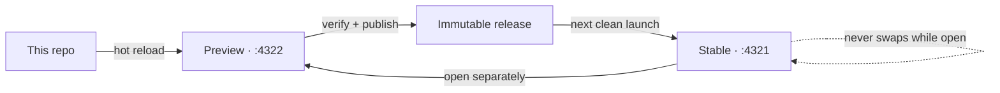

# SystemSketch

SystemSketch now starts from one deliberately boring datum: the stock tldraw whiteboard. Its tools, shapes, menus, shortcuts, and components are unmodified. The only product UI is a small top pill that separates a verified **Stable** build from a hot-reloading **Preview** of this repo.

[Open the rendered foundation report](docs/systemsketch-foundation-2026-08-30.html)

## The starting point

- `tldraw@5.3.2`, pinned exactly.
- Stock `<Tldraw>` UI with no component, tool, shape, binding, or menu overrides.
- One `persistenceKey`, so the local canvas survives refreshes.
- Self-hosted tldraw assets and the SDK license-key seam.
- The update pill is a sibling overlay; it does not enter tldraw's component registry or document store.

## Evolving it safely



- The dock icon always opens Stable.
- Stable serves a content-addressed immutable release and does not swap code underneath an open canvas.
- Preview runs Vite from this checkout and updates live as agents edit React/CSS.
- Stable and Preview use separate ports and browser profiles, so both cannot write the same browser-local canvas.
- **Publish Preview** runs type checks, frontend tests, Python release tests, and a production build before advancing the Stable pointer.
- The previous verified Stable build remains available for rollback on the next launch.

## Commands

```bash
npm install
npm run check
npm run desktop:install
npm run desktop:start
npm run desktop:preview
npm run desktop:status
```

The installed runtime lives under `~/.local/share/systemsketch/runtime`. The dock entry remains `systemsketch.desktop`, so the existing pinned application follows the new repo without creating a second app identity.

## Next rung

The next product change can replace or reshape the stock chrome toward Excalidraw while keeping this release boundary intact. Treat every such change as a Preview mutation first; do not add a second canvas implementation or another release lane.
