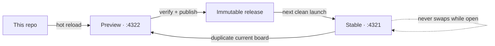

# SystemSketch

SystemSketch starts from one deliberately boring datum: the stock tldraw whiteboard. Its engine, drawing tools, and shortcuts stay stock while narrow supported seams add local files, board overview, zoom, Help, and the Stable/Preview workflow.

The [semantic-role inheritance implementation gallery](docs/semantic-role-inheritance-implementation-2026-09-04.html) records the port-first role model: authored and analyser-derived claims resolve as authored → derived → implicit Data, while cables read endpoint roles live instead of persisting a duplicate. The ready-to-drive [`semantic-role-inheritance.systemsketch`](sketches/review/semantic-role-inheritance.systemsketch) board demonstrates an intentional Event → Control mismatch that remains legal and visible with provenance in the Connection inspector.

The [control-icon placement implementation gallery](docs/control-icon-placement-implementation-2026-09-03.html) records the deliberately offline Python pass for <code>break</code>/<code>continue</code>: explicit source-owner maps write persistent Loop / Branch-arm metadata, and the canvas only paints those lists in a fixed right-aligned header lane. Its six-case [`control-icon-placement.systemsketch`](sketches/review/control-icon-placement.systemsketch) fixture is ready to review.

The [V5 variadic-parameter-port implementation gallery](docs/variadic-port-v5-implementation-2026-09-03.html) shows the settled Python <code>*args</code>/<code>**kwargs</code> grammar in a live SystemSketch board: each real call expression keeps its own cableable port, while quiet brackets, labels, and collars explain the callee-owned groups. Its companion [`variadic-port-v5.systemsketch`](sketches/review/variadic-port-v5.systemsketch) is ready to open and inspect; the unusual manual escape hatch lives in the Block inspector rather than a canvas gesture.

The [review-server lifecycle investigation](docs/server-lifecycle-investigation-2026-09-03.html) explains why a track URL disappears after its chat ends: `serve.sh` is deliberately task-owned. The [retained-review runtime gallery](docs/review-runtime-persistence-2026-09-03.html) records the shipped alternative: `npm run review -- up …` pins a committed board/report in its own worktree, waits for its public health check, supervises the pair, and stays live until `down NAME` or `down --all` is explicitly requested.

The [Preview board-recovery gallery](docs/preview-board-recovery-2026-09-03.html) records the safe reopen path for an old, multi-page SystemSketch board: a required Block style property is migrated before validation, Branch arm repair waits until the loading transaction finishes, and the recovered Series A board opens with all 598 shapes intact instead of being replaced by an empty canvas.

The [reverse-compatibility gallery](docs/reverse-compatibility-2026-09-03.html) makes rollback explicit: a parseable board from a newer SystemSketch version stays read-only and byte-exact, then **Make compatible copy…** creates and opens a separate stock `.tldr` whose readable Blocks, regions, and semantic edges are editable primitives. An unreadable board has no fake “recovery” copy—the original is untouched and the UI says that no board data was loaded. The gallery carries the real modal, both safety states, the 9-check future-format journey, the 6-check unreadable-file journey, and a ready-to-drive review board. [PEP 0001](docs/pep-0001-reverse-compatible-portable-copies.md) is the durable compatibility policy behind that behavior.

## Current improvement review

P2 (icon on the owning region's own header row) is picked. [`control_icon_placement_rule.py`](docs/control_icon_placement_rule.py) is the real, tested `ast`-driven spec for computing WHICH header each `break`/`continue` belongs to — three rules (an `if`/`elif`/`else` chain changes the owner one arm at a time; a nested `for`/`while` is never descended into, since Python itself binds `break`/`continue` to the nearest enclosing loop; `try`/`except`/`with` are transparent, a fix that only surfaced because the first draft silently missed every exit inside a `try` block until it was actually run). The [six-case coverage gallery](docs/control-icon-placement-cases-2026-09-03.html) draws each diagram FROM that function's real return value, not from a hand-placed icon — including the one genuinely realistic way to get two different icons sharing a single header (different `except` handlers, not two bare statements, which turn out to be dead code side by side) and the boundary case where a nested loop's own `break` produces zero icons on the outer loop. [A work order](docs/work-order-control-icon-placement-2026-09-03.md) hands the implementation to another agent: exact integration points in `src/branch/BranchCanvas.tsx` (the arm header row, right where fold/make-active already live) and `src/loop/LoopCanvas.tsx`, the "whiteboard stays dumb, Python stays rigid" boundary this must respect, and the six cases as acceptance criteria. Nothing under `src/` touched yet.

The [loop control-icon placement gallery](docs/loop-control-icons-2026-09-03.html) generalizes the settled `break` icon (B5 from the break gallery) to `continue` — same red, un-wired family, a distinct shape (stop octagon vs. skip-ahead pill) — and answers the harder question Zach asked next: where do these icons go when several live inside different arms of a Branch nested in a loop? Five placement policies on one fixture (a 3-arm Branch inside the settled `While Loop` header: `if error > big: break`, `elif drift > tol: continue`, `else:` falls through). **P2, promoting the icon to the arm's own header row — the same slot Branch already reserves for fold and make-active — scores highest at 74/100** for needing nothing new to learn, one fixed column to scan regardless of arm length; P1 (inline right after the triggering line) is a close second when exact-line precision matters more than a scannable column. Also states the shared rule that isn't a variable across any of the five: data cables keep reading left to right exactly as shipped; control icons are read by following the code's own order, top to bottom, arm to arm.

The [port outline gallery](docs/port-outline-gallery-2026-09-03.html) catalogues every port kind the app has — Block's port/simple/expanded/value views, every port-colour family, ports on the left, right, top and bottom edges (a `mut` effect port; Loop's `item` outlet), a wired port's filled core, a many-to-one producer badge, an unconnected default-value core, and Branch's and Loop's control/header ports — one real screenshot per configuration at a legible zoom, each with the exact alignment checks read from the same run that captured it, plus a resize matrix (tiny through 1100×190, and one real mouse-drag on the resize handle) for all three shapes. Loop landed on main partway through the review; §3 records how it was folded in — its `getIndicatorPath` shipped with the same hand-copied magic radius Block and Branch had, fixed alongside them.

The [port outline alignment report](docs/port-outline-alignment-2026-09-03.html) fixes the bug the gallery above now guards: tldraw's selection/hover outline (`getIndicatorPath`, stroked to a `<canvas>` since v5) is computed independently of the live `.Port` dot it is meant to trace, and Simple Block's ports — `subtle`, invisible until canvas hover — were skipped by that path entirely, so selecting and hovering a Simple Block drew the edge straight through its own port dot instead of arcing a socket around it. The fix deletes the one skip; `getIndicatorPath` on Block, Branch and Loop also lose a hand-copied magic radius in favor of the constant it was always supposed to equal. `npm run test:port-alignment` (`tests/port_outline_alignment_smoke.mjs`) proves it end to end by measuring the app's own `getShapePageTransform` + `pageToScreen` against the painted DOM rather than diffing screenshots; reverting the fix turns exactly the two Simple-view checks red and leaves the rest green — confirmed twice, once on the original two shapes and again after rebuilding this fix fresh against a much newer main.

The concise [project preferences](docs/project-preferences.md) record the coding model guiding
SystemSketch: one canonical definition with linked occurrences, a dataflow-first representation,
Python-shaped projections, and a boundary between program meaning and canvas presentation.

The [manual pill-derivation gallery](docs/pill-manual-derivation-2026-09-03.html) makes the whiteboard-hackability preference concrete: wiring leaves a pill’s literal and type alone, while **Adopt cable type** remains available from the selected pill and command palette when that calculation is wanted.

The [linked Definition cable-drag repair gallery](docs/linked-definition-port-drag-2026-09-03.html) records the exact recovered-pipeline crash and its fix: a real port drag now exits tldraw’s atomic pointer update before Definition-body propagation mirrors the cable. The companion [`linked-definition-port-drag.systemsketch`](sketches/review/linked-definition-port-drag.systemsketch) is ready to review on this track.
The [while-loop break gallery](docs/while-loop-break-2026-09-03.html) answers the question Zach asked directly against his own settled header design (a hollow ring at the region's top-left corner, fed from outside — drawn identically in all ten boards, no longer a variable): how should `break` look, given "the issue is break is not data flow... I feel like I may not actually be able to represent it, and that is fine!" Ten marks, several of them deliberate admissions that a break can only be approximated — not represented — in a pure dataflow grammar, scored against six criteria including an explicit honesty-about-the-limit one. **B5, an inline stop icon beside the block that can break with no wire drawn anywhere, wins at 81/100** for costing nothing and never risking a control signal being mistaken for a data cable; B10's header-only badge (79) and B6's reuse of the existing dashed event rail (78) are the runners-up. If localising exactly where control goes after a break matters more than staying minimal, B4 (a plain escape arrow through the region's wall) and B3 (BPMN's boundary-event icon) are named as the two to look at instead. A second body block, `check()`, exists purely so break has somewhere to originate that isn't the loop's only block. Also settles two smaller open questions: the loop's exit cable stays plain dotted with no label and no `z⁻¹` chip (that mark stays reserved for the true one-iteration-late back cable), and the "condition mutated inside the body" cable composes unchanged with whichever break mark is picked.

The [Preview-to-Stable workspace handoff gallery](docs/promoted-workspace-handoff-2026-09-03.html) shows the new build-keyed transfer that lets Stable reopen Preview’s saved active board with its recent files and reviewed app preferences. It is intentionally not a copied browser profile: the handoff is capped, allowlisted, build-matched, applied once, and never overrides an explicit `?board=` link. The companion [`promoted-workspace-handoff.systemsketch`](sketches/review/promoted-workspace-handoff.systemsketch) board is ready to review at `http://127.0.0.1:4540/`.

The [while-loop header gallery](docs/while-loop-header-2026-09-03.html) closes the gap the shipped `for` loop left open: its header settled as an operator (a real `Iterable` inlet, a real `Iter` outlet), but no equivalent pass was ever run for `while` — the one prior fixture that draws one at all predates that decision and just writes the whole condition as the region's title. Ten header treatments on the same tracker fixture, everything else (the region, the back cable, the `z⁻¹` chip, the seed|back receiver) held exactly as shipped. **W2, a real typed `Bool` inlet mirroring `for`'s `Iterable`, and W10, one generalized port shared by both loop kinds, tie at 81/100**; **W6, chaining a second pill onto the already-shipped `z⁻¹` back-cable lane, is one point behind at 80** and is not mutually exclusive with either. Five sources of prior art (MLIR `scf.while`, LabVIEW's Conditional Terminal, Simulink's While Iterator, Unreal's `WhileLoop`, the Dennis/Arvind loop schema) read for the one moment a `while` genuinely diverges from a `for`: it re-checks every pass, on a value usually produced *inside* the loop it's gating. No `src/loop/` file was touched — static SVG mockups in the idiom, exactly like every prior loop babble.

The [document-draft journey Babble](docs/draft-journey-babble-2026-09-03.html) is five full-walkthrough UIs for one canvas: open **Main**, create a **Draft**, edit, leave and return, review **changes**, **Merge**. They are HTML chrome prototypes (not product tracks and not tldraw pages). Co-leaders are **Workspace column** (88.8) and **Page-stack** (88.0); **Minimal bar** is the cleanliness pick at 85.6. Open `file:///home/bam/systemsketch/docs/draft-journey-babble-2026-09-03.html`.

The [20-example mutating-line review](docs/mutating-line-review-2026-09-03.html) judges the effect-port grammar against 20 real mutating-call examples on one board (`sketches/review/mutating-line-examples.systemsketch`), easy to hard — `list.append`, dual-channel `dict.pop`, a deliberately reversed `swap`, and 2/3-level nesting — across Port, Expanded, and Simple views. `/llm-judge` does not exist in this repo; the report says so and substitutes a manual crop-by-crop pass, checked against the live DOM/computed styles/SVG path data rather than screenshots alone, which closed four false alarms (a hook that only looked missing at overview scale, a port ring that only looked mis-coloured on a screenshot, a pill that was just out of frame, and Simple-view's pre-existing long-title wrapping). It also confirms one real, general finding: two effect cables with similar endpoint geometry route through an identical corridor and their `mut` pills stack, because the only route-separation mechanism in the app (`tidyEdges.ts`, Tidy Edges) is a manual command, not an automatic nudge on cable creation — recorded as routing-disambiguation follow-up work, not patched here.

The [Preview regression and performance audit](docs/preview-regression-audit-2026-09-03.html) checks the latest committed merge stack for saved-board compatibility, interaction hot paths, and release coverage. It repairs the missing Block diff migrations that quarantined older boards, isolates all six Block versions as pure record-to-record transformations, moves Problems off transform-only frames, removes hidden connector/tunnel work from common drags, parses every committed review board, and records the one remaining unconfirmed cable-drag stall. Merge reconciliation also checkpointed the three formerly uncommitted diff journeys and verified all 28 browser checks. The companion [`preview-regression-audit.systemsketch`](sketches/review/preview-regression-audit.systemsketch) board is ready for the drag-and-undo review gesture.

The [Loop contents-layout gallery](docs/loop-contents-layout-2026-09-03.html) extends the existing container-layout contract to For Loops: select a Loop with two or more direct child Blocks and its contextual pill now offers **Organize nodes** (plus **Tidy edges** when its interior cables apply). The Loop header remains an operator rather than being pretended into a left/right port rail; the body is the bounded layout area, and an empty selection pill is no longer mounted. The companion [`loop-contents-layout.systemsketch`](sketches/review/loop-contents-layout.systemsketch) board is live on this track for direct review.

The [light/dark UI visibility audit](docs/ui-visibility-audit-2026-09-03.html) records the repair for the P0 standalone file-workspace defect: `ThemeRoot` now owns one in-tree portal host, so Radix workspace dialogs and the recorder notice inherit the selected appearance instead of falling back to body-level defaults. The report leads with six matched raw before/after journeys—Rename in all five appearances plus the Light Open browser—and six independent post-fix control frames, each linked to its PNG source. The real-browser sweep is 265/265 across five shipped themes, including a DOM-host assertion for Rename and Open; a separate 900 px pointer/keyboard pass confirms surfaced Light and Dark dialogs. The companion [`portal-theme-inheritance.systemsketch`](sketches/review/portal-theme-inheritance.systemsketch) board is ready for direct verification.

The [UI and visual-language PEP](docs/pep-ui-visual-language.md) establishes
the maintained rule for blank authored fields: permanent labels plus short,
generic field-role guidance—never fabricated example content.

The [inspector field-guidance gallery](docs/inspector-field-guidance-2026-09-03.html)
shows the shared vocabulary, the captured running inspector, and the real-browser
evidence behind this change.
The [canvas Python-signature pill gallery](docs/canvas-python-pill-entry-2026-09-03.html) makes a fresh pill start where a code line starts: its name. Type `pose: Pose = 2` on the canvas and it separates into a variable name, its type annotation, and the literal in one gesture; a bare `2.0` remains the concise unnamed literal. The face now visibly reads `pose: Pose = 2`, while the inspector stays a raw Name / Value / Type editor with no auto-formatting. New input ports accept that same canvas declaration and take the right-hand side as their default.

The [pill inline-draft gallery](docs/pill-inline-draft-2026-09-03.html) fixes the moment before that commit: while entering a declaration, the pill has one left-aligned input and its underlying canvas glyphs pause rather than doubling behind it. The capsule continues to widen rightward, and a fresh [`pill-inline-draft.systemsketch`](sketches/review/pill-inline-draft.systemsketch) board starts at the exact review gesture.

The [inline document-rename UX gallery](docs/inline-document-rename-ux-2026-09-03.html) ships ten friction removals around the filename: click-to-edit in the header instead of a modal; selected-on-entry, F2, Enter, blur-to-commit, Escape-to-cancel, in-place validation, and a narrow shell that keeps both document identity and Board scope readable. The existing workspace rename transaction still owns the digest fence and immutable file type. The guided [`inline-document-rename.systemsketch`](sketches/review/inline-document-rename.systemsketch) board is ready to drive in the track Preview.

The [text fields + stock tldraw review](docs/text-field-stock-seams-2026-09-03.html) maps every text-surface family to the interaction contract it actually needs. Its [implemented chrome-input gallery](docs/chrome-stock-input-mechanics-2026-09-03.html) now documents the resulting `SystemSketchUiInput` adapter: header filename, workspace Filter, Rename/Save As/Export names, and New folder use stock tldraw mechanics; canvas shape editors, live inspector fields, commands, and multiline prose intentionally retain their specialized contracts. The guided [`chrome-stock-input-mechanics.systemsketch`](sketches/review/chrome-stock-input-mechanics.systemsketch) board is ready to drive in the track Preview, and the same rule is now recorded in `AGENTS.md` for future chrome work.

The [workspace pathbar visual-polish gallery](docs/workspace-pathbar-visual-polish-2026-09-03.html) closes a real narrow-dialog defect: the stock-backed Filter now uses the pathbar's available width rather than allowing its content-box padding to meet the modal edge. It includes a 320 px before/after capture, exact geometry proof, and the light/dark desktop journeys used for the wider chrome pass. The companion [`workspace-pathbar-visual-polish.systemsketch`](sketches/review/workspace-pathbar-visual-polish.systemsketch) is ready to review.

The [Loop region implementation gallery](docs/loop-region-implementation-2026-09-03.html) builds golden 10's `for` as a frame-like region whose header is an operator, with the element leaving through a real port on an ordinary solid cable. It also records the container hit-zone contract every region now shares: an `isLabel` band is solid chrome, a frame-like face stops tldraw's hit search, and — because the same predicate resolves a drop target — a cable inside a region has to be that region's child to stay clickable. The companion [`loop-region.systemsketch`](sketches/review/loop-region.systemsketch) board is ready for direct human verification.

The [Loop header-centering gallery](docs/loop-header-centering-2026-09-03.html) documents the responsive title rule: long operator names use the safe header lane while compact, then move to the Loop's true midpoint as soon as their complete text fits there. Its focused [`loop-header-centering.systemsketch`](sketches/review/loop-header-centering.systemsketch) review board starts compact and gives the exact resize gesture and visible pass condition.

The [`?` and projection implementation report](docs/unknown-projection-implementation-2026-09-03.html) lands both picks from the two galleries below. `UNKNOWN_TOKEN = '?'` is the one spelling for *we looked and cannot tell* — blank still means *nobody annotated this*, and `Any` is left alone because a program can declare it. **Mark unresolved** sets `blockType: 'unresolved'` and the view to Simple in one undo step, and fills with a single `?` only the type slots that are empty: `self: Client` survives, because the receiver is annotated where the call is written, and a name is never touched. Nothing is inferred from a neighbouring cable, a row that already states a type goes unknown through the port's own **Mark unknown**, and nothing is *policed* — type a `?` into a name and it stays. One `?` per row is the pyblocks projection's convention, written down in that repo's `docs/unknown-slot-convention.md`, not a rule this layer enforces. A projection is an ordinary Block: **Split** joins the connection-drop offer, titles itself from the type on the cable, and its accessor rows are normalized in one place, so `.pose.translation.x` stays a single row and carries no `?` at all. No new shape, no new port field, no migration. Proof is `npm run test:unknown` — 28/28 checks driven in a real browser — plus the [`unknown-projection.systemsketch`](sketches/review/unknown-projection.systemsketch) board.

The [symbol-opacity gallery](docs/symbol-opacity-babble-2026-09-03.html) is where that `?` came from: ten grammars for what a Block says about a callee it could not resolve, each a real board under `sketches/review/opacity-v*.systemsketch`. It measures the premise first — `undefined` appears **0** times across the 48 boards the golden corpus ships, while **540 of 1107** ports already carry no type at all — so the question is which channel rather than which word. **The frame says it once** led at 92.0 with **Simple view** two points behind and composable rather than rival.

The [splitter gallery](docs/splitter-babble-2026-09-03.html) answers where a projection (`self.shape`, `response.id`) is drawn, with five directions over golden 33's real `ObjectRecord`. Two findings precede the variants: one-to-many across types is not a new arity rule but the existing per-cable type check firing once per landing, and `.x` is `getattr`, so a projection is a call. **Derived Block** led at 96.0, and premade-per-type loses on a measurement — `ObjectRecord` declares 20 fields and the body reads 7, so a frozen splitter draws 13 dead ports. Boards: `sketches/review/splitter-s*.systemsketch`.

The [contextual menu diff report](docs/contextual-menu-diff-2026-09-03.html), second edition, closes gaps its first edition only named: the Shape trigger now shows FigJam's fixed circle-and-square glyph instead of a live preview of the current geo, typography controls (Typeface/Font size/alignment) stay hidden on a shape until it actually has text, and a connector now gets a real **Add text** button in FigJam's exact spot instead of a decorative Typeface trigger — all proven by 36/36 unit tests and re-captured screenshots, so Rectangle, Arrow and Arrow+text now read as pixel-level matches. It also retracts a first-edition claim: "Line + text" was never a real product state — a stock tldraw Line has no `richText` field at all, so double-clicking one creates an unrelated floating Text shape rather than labelling the line; that's now recorded as blocked by schema, not a bug. A new judge pass presses every trigger on both apps (28 FigJam popovers, 20 SystemSketch ones) and finds one real remaining gap — FigJam's Shape picker is a searchable icon-only grid, SystemSketch's is a labelled list — scoped explicitly rather than fixed today, alongside an explicit exception list for what SystemSketch adds on purpose and what it omits on purpose. `tools/figjam/menu_diff_capture.py` and `tests/menu_diff_capture.mjs` (both take `--walk` for the popover pass) are the two capture instruments.

The [turn-a-selection-into-a-container implementation gallery](docs/wrap-selection-implementation-2026-09-03.html) ships both surfaces from its [five-variant comparison](docs/turn-selection-into-babble-2026-09-03.html), because that lead was only 3.2 points: a **Wrap** tile on the floating selection menu, mounted only while two or more objects are selected, and **`Turn into ▸`** in the right-click menu. Both read one descriptor table and run one command. Frame and Group dispatch through the stock `frame-selection` and `group` actions rather than being reimplemented; only Block (flipped to Expanded, the only view that holds children) and Branch region are ours, each reusing the adopt-what-it-encloses move its own tool already makes. Wrapping derives nothing — no port synthesis, no inference, no lint. The duplicate pair collapsed: stock `Remove frame` is renamed **"Delete container, leave children"** and the Frame-only command it superseded is gone. Reading the pinned engine also turned up a live bug: `frame-selection` registers `kbd: 'cmd+alt+g'` with no ctrl alternative while `group` gets `'cmd+g,ctrl+g'`, so the advertised Ctrl+Alt+G cannot fire on Linux. 15 unit tests and a 14-check real-browser journey; the companion [`wrap-selection.systemsketch`](sketches/review/wrap-selection.systemsketch) board is ready for direct human verification.

The [Enso · Neva · unit reference report](docs/reference-learnings-2026-09-02.html) reads three outside dataflow systems against the questions open here, from their own docs and source, with screenshots captured by driving real headless Chrome over the live sites. Neva makes many-to-one an ordinary `FanIn` node with numbered slots rather than a rendering rule, has no loop construct at all (a `stream<T>` ends and a stage folds it), and states that a deferred connection defers *receiving*, not sending; Enso picks a per-argument widget through a scored registry instead of one literal chip, and derives a collapsed component's signature from what crosses the selection boundary; unit composes by drawing a contour around nodes. Every SystemSketch number in it is measured from the tree at build time.

The [draw.io persistence-alignment gallery](docs/drawio-persistence-alignment-2026-09-03.html) turns the current draw.io 31.4.2 implementation into an explicit architecture decision: adopt its proven readback, bounded-deferral, preserve-both, and in-flight-edit invariants while retaining SystemSketch's stronger digest CAS, cross-process lock, and atomic publication. It has one checkbox and feedback field per adopted change, intentional divergence, and bounded deferral; **Copy Markdown decisions** produces a response that can be pasted straight back into Codex. It is a self-contained static HTML file and needs no report server.

The earlier [workspace-robustness reference review](docs/workspace-robustness-reference-review-2026-09-03.html) applies the overnight feedback and compares the eight accepted protections with exact revisions of draw.io Desktop, current tldraw, the supplied pre-internal tldraw-offline branch, and Excalidraw. It distinguishes mature precedent from SystemSketch-specific safeguards, links every retained behavior to its adjacent `WHY` comment and executable proof, records #09/#10 as removed and #11–#30 as not queued, and works as a self-contained static file with no report server. The [reconciled 30-item audit](docs/overnight-top-ten-review-2026-09-03.html) preserves the original ranking and the final accept/remove/park decisions.

The [Block presentation / Value-pill boundary gallery](docs/expanded-view-glyph-fix-2026-09-02.html) fixes the duplicated **E** in the floating Block selection menu by restoring its real scope: ordinary Blocks offer only **S / P / E**, while Value remains a separate literal-pill representation created through its own flows. It records the contextual-menu audit and a companion [`expanded-view-glyph.systemsketch`](sketches/review/expanded-view-glyph.systemsketch) board with both representations prepared for direct human verification.

The [for-loop visual grammar Babble + Prune gallery](docs/for-loop-visual-grammar-babble-2026-09-02.html) compares ten genuinely different ways to expose iteration, loop-carried state, and completion without turning the body back into code. Its top three—Paired Gates, Header Lanes, and State Pills—are each exercised against the same five Python loops from a stateless map through nested early exit, yielding fifteen matched examples on the companion [`for-loop-visual-grammar.systemsketch`](sketches/review/for-loop-visual-grammar.systemsketch) board.

The [Delete container, leave children gallery](docs/remove-frame-keep-contents-2026-09-02.html) proves the descriptive stock-container right-click command: direct children are lifted through tldraw’s reparent seam before the now-empty Frame is deleted, preserving exact page positions and nested hierarchies as one undoable operation. The companion [`remove-frame-keep-contents.systemsketch`](sketches/review/remove-frame-keep-contents.systemsketch) board is ready for direct verification.

The [Step In overlap-relocation gallery](docs/step-in-overlap-relocation-2026-09-02.html) proves the no-hidden-nodes rule: if a resize inside an isolated scope would cover a sibling, the active Expanded Block and its existing descendants move to the nearest clear position while sibling coordinates and every parent chain remain unchanged. The selected active scope now says **Step out** across the mini-menu, context menu, and Block footer. The companion [`step-in-overlap-relocation.systemsketch`](sketches/review/step-in-overlap-relocation.systemsketch) board is ready for direct verification.

The [edge-tunnel implementation gallery](docs/edge-tunnel-implementation-2026-09-02.html) ports PyBlocks' long-run visibility treatment onto SystemSketch's existing semantic connection: an idle tunnel leaves two short endpoint stubs and outlined mouths; hover restores the run without removing those mouths; and focusing a named layer fully reveals its members while tunneling every other edge. Its companion [`edge-tunnel.systemsketch`](sketches/review/edge-tunnel.systemsketch) board is ready for direct human verification.

The [count-free selection-menu gallery](docs/selection-count-removal-2026-09-02.html) records the FigJam-aligned removal of visible selection totals: three Blocks retain their S / P / E, appearance and Inspect actions with no “3 selected” or “3 Blocks” prefix; the Inspector calls the state **Batch edit**. It includes the saved review-board journey and source-level guardrails for the replacement selection-identity refresh.

The [true Step In + one-canvas implementation gallery](docs/step-in-single-page-2026-09-02.html) replaces the old canvas-coloured scope mask with editor-level visibility, so unrelated shapes leave both paint and hit testing while ports and stock resize controls remain usable outside the active Block edge. SystemSketch now exposes exactly one canvas: multi-page tldraw files migrate into named stock Frames and persist that result, while Depth Stack occupies the former page-selector slot. The companion [`step-in-single-page.systemsketch`](sketches/review/step-in-single-page.systemsketch) board is ready for direct human verification.

The [Expanded Block footer-drag gallery](docs/expanded-footer-drag-2026-09-02.html) proves the footer and painted port words are real drag handles again while the open middle remains drawable child canvas. Its focused real-browser journey covers both selected and cold footer drags, a port-text drag, and the negative interior control.

The [UI/UX hardening report](docs/ui-hardening-2026-09-03.html) records a 30-candidate pass made by driving the running product in a real browser rather than reading the source, and ships the top ten. The right dock now follows the selection for every subject — there is no `Inspect` button on either pill, because it only ever meant "show me the panel for what I already selected" — and an ordinary shape gets the facts tldraw holds rather than a Block placeholder. It carries before/after captures taken from a throwaway copy of `main`, the full 18-check journey (`npm run test:ui-hardening`), every candidate with its state, and a ready-to-drive review board. The remaining twenty are listed as named follow-ups rather than dropped.

The [35-item repo improvement review](docs/repo-improvement-review-2026-09-02.html) ranks the audited gaps, shows the top ten already running with real-browser evidence, and gives each shipped fix and remaining candidate its own accept checkbox and review note. The [follow-up decision gallery](docs/repo-improvement-followup-review-2026-09-02.html) covers the revised future-format workflow plus comments, commands, timer removal, diagnostics, and folder creation with one accept checkbox and note field per change. These are temporary decision surfaces; code and ordinary regression tests remain the living specification.

The [Tidy Edges + Organize Nodes comparison](docs/layout-comparison-2026-09-02.html) runs the ported PyBlocks architecture against 46 synthetic cases: 20 edge-channel fixtures and 26 node-layout fixtures, including six multi-port cases across aligned, offset, and mixed Blocks. The evaluator now rejects stacked/uneven rail cadence as well as endpoint, authored-route, orthogonality, and idempotence regressions. Commands are selection-local: Organize moves only selected Blocks; Tidy changes selected edges plus edges incident to selected Blocks, while unselected edges remain routing constraints. A real-app stress journey proves that contract in a 36-Block / 87-edge view. The companion [`tidy-edges-selection.systemsketch`](sketches/review/tidy-edges-selection.systemsketch) and [`organize-nodes-port-layout.systemsketch`](sketches/review/organize-nodes-port-layout.systemsketch) boards are ready for direct human verification.

The [collision-aware Tidy routing implementation gallery](docs/collision-aware-routing-2026-09-02.html) shows automatic elbow edges clearing intervening Blocks and entering only the legal target arm of a Branch, while hand-authored bends remain locked. Obstacle collection, one-edge planning, route stability, collision-safe channel nudging, and editor persistence are deliberately separate functions with independent regression tests; the browser proof samples the painted SVG paths. The companion [`collision-aware-routing.systemsketch`](sketches/review/collision-aware-routing.systemsketch) board is ready for direct human verification.

The [50-case collision-routing stress report](docs/collision-routing-stress-2026-09-02.html) drives Tidy twice in the real app across dense Block fields, near-endpoint obstacles, and both Branch arms. It records every result, the two routing defects the matrix exposed, representative painted-path evidence, and the deliberately unmerged review boundary.

The [text-aware multi-elbow routing gallery](docs/text-aware-routing-2026-09-03.html) extends Tidy's collision model to painted port names, types, and default chips. Its faithful three-port supplied-case proof keeps a straight exit beside `poses list[Pose]`, explains why shortest-path scoring currently hugs one side of the open channel, and shows 20 real-app routes from easy fields through endpoint squeezes and Branch targets. The companion [`text-aware-routing.systemsketch`](sketches/review/text-aware-routing.systemsketch) board is ready for the select-frame, then Tidy edges review gesture.

The [Tidy soft-clearance gallery](docs/tidy-soft-clearance-2026-09-03.html) adds a fully zeroable local preference for data cables to avoid near misses and interior crossings while retaining the existing hard Block, Branch, and port-label clearances. Its real-canvas replay uses the corrected `gain → add.in_2` and `frame → adjust.in_2` wiring with a lowered `add()`: one Tidy removes the visible frame/gain crossing without moving any node. The report records every active weight, its deterministic local priority tie-break, and the yFiles, ELK, and libavoid prior-art boundary.

The [Expanded Block layout-scope report](docs/expanded-block-layout-scope-2026-09-02.html) covers the deliberate one-container exception: selecting one Expanded Block exposes Tidy edges for its directly owned cables and Organize nodes for its immediate child Blocks. Parent input/output ports act as virtual layout rails; nested Expanded Blocks stay atomic; exterior incident cables and nested interiors stay untouched; and a too-small parent yields a no-op rather than an implicit resize. The companion [`expanded-block-layout-scope.systemsketch`](sketches/review/expanded-block-layout-scope.systemsketch) is ready for the select-parent, tidy, then organize review gesture.

The [organizing inside an Expanded Block architecture gallery](docs/organize-inside-block-babble-2026-09-02.html) compares five ways for a fixed parent’s inner-face ports to influence selected child placement. It provisionally recommends two ephemeral boundary rails inside the existing flat ELK solve—not a persisted fake Block and not an ELK-owned compound parent—with exact port identity/order, SystemSketch-owned routing, scope-local processing, and a hard no-overflow guard.

The [contextual tidy-controls implementation gallery](docs/contextual-tidy-controls-2026-09-02.html) adds those same selection-scoped commands to the floating toolbar: a bent-route glyph appears for selected or incident semantic edges, while a FigJam-like 3×3 grid appears for two or more selected Blocks. Inapplicable controls stay out of the compact pill, both buttons carry accessible names and tooltips, and the five-check real-browser journey proves edge-only, incident-edge, mixed availability, invocation, and zero console errors. Its [`contextual-tidy-controls.systemsketch`](sketches/review/contextual-tidy-controls.systemsketch) review board exercises both controls against a fixed unselected sentinel.

The [Ctrl+P command-palette implementation gallery](docs/command-palette-ctrl-p-2026-09-02.html) shows the editor-style shortcut opening the real Commands dialog with search focused while suppressing the browser print action. Ctrl+K remains a compatibility alias, Ctrl+F still opens board Find & replace, and the linked review board is ready to drive on the current Preview.

The [modal-layer contract gallery](docs/modal-layer-contract-2026-09-02.html) shows why a large child z-index could not dim Preview or the surrounding application chrome, compares the portaled fix with the failure, and records the layer audit and reusable rule for future full-surface UI.

[Open the rendered foundation report](docs/systemsketch-foundation-2026-08-30.html)

## The starting point

- `tldraw@5.3.2`, pinned exactly.
- Stock `<Tldraw>` engine extended through its supported component, shape, and mount seams.
- One local `.systemsketch` document is canonical; autosave and smart reopen survive refreshes, while portable export produces a stock-readable `.tldr`.
- Self-hosted tldraw assets and the SDK license-key seam.
- Release status is tucked into Help instead of occupying the top of the canvas.

## Evolving it safely



- The dock icon always opens Stable.
- Stable serves a content-addressed immutable release and does not swap code underneath an open canvas.
- Preview runs Vite from this checkout and updates live as agents edit React/CSS.
- Preview fingerprints the Python workspace controller at startup; opening Preview after controller edits safely replaces the launcher-owned API/Vite pair so the hot frontend cannot drift onto an old local API.
- **Open Live Preview** snapshots the current board, opens the copy in a new Preview window, and then lets the two browser profiles evolve independently.
- Browser-local images are made portable during that one-time handoff rather than pointing back to Stable's private asset store.
- Stable and Preview use separate ports and browser profiles; when they intentionally point at the same local file, a content-digest fence prevents silent clobbers.
- **Publish Preview** runs type checks, frontend tests, Python release tests, and a production build
  before advancing the standalone Stable pointer. It then attempts the VS Code/Cursor and Obsidian
  plugin builds as a best-effort follow-up; a host failure cannot roll back or interrupt the app.
  Successful host artifacts are immutable beside that Stable build.
- The previous verified Stable build remains available for rollback on the next launch.

## Development operating loop

Product changes close one vertical user behavior at a time: define its observable proof, implement the thinnest path, exercise it in the deployed app, and validate it with a real sketch before starting the next behavior. The [UI development operating loop](docs/ui-development-operating-loop-2026-08-30.html) records the evidence, micro-V model, WIP guardrails, and recommended first slice.

The [review-fixture implementation gallery](docs/systemsketch-review-fixture-2026-09-01.html) adds the human handoff surface to that loop. After a feature is finished, the repo-local skill creates a disposable `.systemsketch` with the real objects already in place, numbered orange gesture cues, a green visible pass condition, and a direct Preview URL. Its helper authors through the current SystemSketch editor, then verifies autosave and a cold reopen instead of hand-maintaining raw tldraw schema JSON.

The [review-fixture legibility loop](docs/review-fixture-legibility-2026-09-02.html) corrects the handoff surface after visual review: cue arrows are stock elbow arrows bound to both the card and the named target edge, cards and same-edge arrow lanes have enforced breathing room, dense text is rejected early, and two reproducible six-board seeds make visual critique part of maintaining the skill rather than a one-off check.

A hard-won decision from that loop outlives the diff in [`docs/peps/`](docs/peps/README.md) — a numbered, dated record (context, decision, rejected alternatives, consequences) written once the change merges to `main`, linked from a `WHY:` comment at the code site. The dated HTML galleries above stay what they've always been, temporary review surfaces; a PEP is the part meant to survive after one goes stale.

The [development worktree document-link report](docs/development-worktree-paths-2026-09-02.html) makes those direct review URLs work on isolated track servers: Preview explicitly authorizes its own source worktree in addition to `.track/boards`, while Stable, the File browser root, neighboring worktrees, and arbitrary machine paths remain confined. The report opens the reported branch-region fixture in the real branch UI and carries the open → autosave → cold-reopen browser proof.

The [independent feature-labs architecture](docs/independent-feature-labs-2026-08-31.html) recommends one production entry point plus development-only stock-tldraw composition profiles, so each feature can be built and proven without importing volatile product chrome or unrelated features. That boundary is now implemented by the Dev Hub below.

The [worktree-per-track workflow review](docs/worktree-track-workflow-2026-09-01.html) evaluates the proposed "one agent per track, in its own worktree" pipeline against this repository as it actually stands. It measures two blockers at build time — the working tree holds 111 files in `src/` while `HEAD` holds 9, and `npm run dev` is pinned to an occupied port with `--strictPort` — and shows that the proposal's last three steps already exist as the Stable/Preview release channels. Git is the write axis; channels are the read axis; a `preview` branch would duplicate one of them.

The [Preview preset switcher Babble + Prune](docs/preview-preset-switcher-babble-2026-08-31.html) compares five interactive ways to launch and sunset those compositions. It provisionally recommends a small named Preset Shelf backed by a typed manifest: one immutable Stable entry, one live Preview runtime, independent document copies, and an `active → archived → removed` lifecycle rather than a new server or codebase per feature.

The [Dev Hub UI integration proposals](docs/dev-hub-ui-proposals-2026-08-31.html) place a dedicated `</>` icon immediately before Help in the existing bottom-right utility strip and compare five interactive destinations behind it. V1 was selected: Stable context, Latest Preview, isolated presets, and version controls live in a sibling anchored shelf, while Help returns to shortcuts and user guidance.

The [Dev Hub implementation report](docs/dev-hub-implementation-2026-09-01.html) shows the shipped profile selector and browser proof. Latest Preview duplicates the current board into the complete product; **Block Dev** and **Stock tldraw** use independent browser-local boards and resolve their exact composition before `<Tldraw>` mounts. Recent isolated presets rise to the top without becoming configurable feature flags.

The [Block / Port / Edge Stable-promotion gallery](docs/block-port-edge-development-profile-2026-09-01.html) shows the released capability running end to end: the restored pyblocks Simple/Port/Expanded canvas UI and 280px inspector, real frame nesting, stable editable ports, inline field editing, default chips, and port-to-port cables. Use it in Stable at `http://127.0.0.1:4321/`; the independent Block Dev lab remains available at `http://127.0.0.1:4322/?preset=block-dev`.

The [collapsed-Block visibility report](docs/block-collapse-visibility-2026-09-01.html) proves the information-hiding contract in the real app: Expanded paints the full nested pipeline, while Simple and Port paint only the boundary Block. Child Blocks and internal cables remain stored, survive reload, and reappear unchanged when the Block is expanded again. It also covers the legacy-connection migration that lets saved pre-routing boards open without resetting local data.

The [Port-on-canvas Babble + Prune gallery](docs/port-canvas-ux-babble-2026-09-01.html) compares ten interactive ways to add, reorder, and delete ports directly inside a Block. It provisionally recommends an explicit **Port Tool** for burst editing, with the table-inspired boundary plus and connected-delete context command retained as the strongest splice parts; production Block behavior is intentionally unchanged until a direction is selected.

The [ports in the header, and the rows they live in](docs/header-port-rows-2026-09-01.html) report makes rows explicit on every port — `row` 0 is the heading, body rows are shared by both lanes, `branch` is an output arm — with a migration off the old dividers, and shows one assignment reducer reached from four surfaces in the real app: the heading's add bead, a hold-and-drag across a line or into the heading, the inspector's mirrored HEADER / ROW / BRANCH list with a grip drag, and a right-click *Move to* menu. Its companion [Babble + Prune gallery](docs/header-port-rows-babble-2026-09-01.html) compares those four with the port-editing mode as five live heroes on one fixture.

The [semantic right-click menu implementation gallery](docs/systemsketch-context-menu-implementation-2026-09-01.html) shows the pyblocks-derived native menu running in the full product composition: checked Block views, structural Add commands with immediate inline editing, Offset/Aligned ports, Expanded depth entry, and Curved/Straight connection routing above the unchanged stock tldraw commands.

The [context-menu reliability report](docs/context-menu-reliability-2026-09-02.html) diagnoses all three layers of the failure: Block inputs swallowed `contextmenu`; tldraw 5.3.2 could split its menu registry from the uncontrolled Radix root after an outside click; and the old recovery re-keyed that root by remounting Canvas, invalidating active Tiptap views. SystemSketch now controls only the Radix root through tldraw's supported `ContextMenu` seam, preserving Canvas identity while retaining stock content, pointer routing, and semantic Block/port commands. The focused browser journey includes the formerly missing dismiss-by-click → reopen transition and passes 8/8 with zero console errors.

The [context-menu reliability report](docs/systemsketch-context-menu-reliability-2026-09-01.html) documents the stock tldraw composition, the Chrome app-window blur state that stranded its menu capture layer, and browser proof for empty-canvas, repeated-open, multi-Block, and blur/return behavior.

The [instant typing after drawing gallery](docs/instant-type-after-draw-2026-09-01.html) records the SystemSketch-wide creation behavior: newly drawn Geos, Arrows, Text, Notes, Frames, and Blocks immediately enter their existing primary text editor. Creation-only gating leaves paste, duplication, restore, remote sync, and shapes without text alone; the Stock tldraw development profile remains an unmodified comparison lane.

The [copy/paste-under-cursor implementation gallery](docs/copy-paste-under-cursor-2026-09-01.html) shows SystemSketch using tldraw's supported `isPasteAtCursorMode` preference across product and development canvases. The live browser proof measures ordinary Ctrl+V at two pointer targets while tldraw continues to own clipboard parsing, shape placement, selection, and history.

The [system-depth navigator Babble + Prune](docs/system-depth-navigator-babble-2026-09-01.html) compares five interactive ways to step into an Expanded Block and recover arbitrary-depth context. It provisionally recommends a compact FigJam-like Depth Stack: real `parentId` ancestry opens on demand, Up is always structural, and descent remains attached to a concrete child Block rather than an undefined global Down arrow.

The [original Depth Stack implementation report](docs/system-depth-navigator-implementation-2026-09-01.html) records the selected V3 navigation at depth two in the real Block Dev canvas: numeric depth, structural Up, direct ancestor jumps, and exact root-camera recovery. Its opaque-mask boundary was the V1 implementation and is superseded by the true-visibility boundary in the current one-canvas gallery above.

The [Block click-to-edit implementation gallery](docs/block-click-to-edit-2026-09-01.html) shows editing text inside a Block behaving like editing text inside a rectangle: the first click activates the Block, the next click opens whichever field it lands on, and a click while already editing moves the editor onto a second field. tldraw's own click-to-edit path is gated on a shape having exactly one text label, which a Block — header plus one label-flagged anchor per port — never has; the gallery carries the byte-identical before frames and the eight-check live browser proof.

The [Block batch-editing implementation report](docs/block-batch-editing-implementation-2026-09-01.html) shows a multi-selection of Blocks behaving like a multi-selection of rectangles. `view`, `portLayout`, `showDescription`, and connection `routing` are declared as tldraw `StyleProp`s, so `getSharedStyles()` reports shared-or-**Mixed** and `setStyleForSelectedShapes()` performs the write — the inspector, the selection mini menu, and the right-click menu are three renderings of the same `SharedStyle`. The report carries the seam diagram, the before/after diff, the eleven-check live browser proof, the two properties that deliberately do not batch, and the stock-tldraw right-click wedge that was diagnosed and fixed along the way.

The [Definition-linking implementation gallery](docs/definition-linking-2026-09-02.html) shows the copy-first model for repeated Blocks: ordinary duplicate and paste preserve an opaque Definition identity; semantic content and the complete Expanded body mirror across occurrences; current view, compact appearance, position, and outer wiring remain local. Finishing a rename against an existing name links matching content, while different content stays independent under the same visible title with a quiet **Draft N** badge and a collision-free internal key such as `run_draft_1`. **Duplicate unlinked** and **Unlink** provide the deliberate escape hatch and allocate `run_1()`, `run_2()`, and so on without a modal. `npm run test:definitions` drives six browser checks, and the linked review board makes the model directly editable.

The [branch-region babble](docs/branch-regions-2026-09-02.html) answers how an `if` should be drawn on a Block board: as a region, not a Block, with cables wired straight to the calls inside and no input tunnels, and with one yield dot per name any arm writes as the region's only port, because that join is the program's φ. Five boards on the `09_branch` golden differ only in where the merge lives (fan-in at the consumer, yield on the border, a merge node, a select block, divider bands); V2 was recommended; Zach picked V1 (wires always, no ports on the region), and §0 of the same page prototypes his pick interactively, second pass: the condition lands on the region's band, every arm header folds to a Simple-view row (cables attach at its edge centres) and carries a make-active target (the other arms fade; none active means all active), Case view is the Expanded layout with at most one arm open per region, nested regions included, drawing only the open case's wires, and every consumer keeps one plain port with ordinary fan-in. `npm run test:case-view` drives it with real mouse events (23 checks). Every number is measured at build time — the analyzer's current 5-in/1-out collapsed region, a per-arm binding probe (`docs/branch_arm_binding.py`) that counts zero sibling-arm reads, and the grammar hooks present in the block model — and the prior art (LabVIEW's Case Structure and tunnels, Simulink's If Action + Merge, MLIR `scf.if`/`yield`, the sea-of-nodes Region/Phi, and a survey of node editors) is reduced to one cited table.

The [loop-region visual research and five-variant babble](docs/loop-regions-2026-09-02.html) carries the branch grammar to `for` and `while` on the `10_loop_carried_state` golden. It now opens with five annotated native screenshots—LabVIEW shift registers, Blender's Repeat Zone, Houdini Block Begin/End, a Simulink For Iterator with Memory, and Unreal's ForLoop macro—so the loop region, iteration item, carried state, return path, and final output can be compared without reconstructing them from prose. The same source is then drawn as five equal-fidelity SystemSketch directions with runnable Seed / Back / Exit walkthroughs and a persistent pick/shortlist/splice surface. L1 “cycle as a cable” remains the 87/100 provisional default; L2 is the fallback for many carried names. The two-pass probe (`docs/loop_carried_binding.py`) recovers seed, back, and exit φ from the source.

The [Branch authoring babble](docs/branch-authoring-babble-2026-09-02.html) answers how a Branch is created and edited: five click-through prototypes on the 09_branch fixture, each producing the settled model (control ports on the band, ordered named arms, view/open/active) and rendering the result with the Case-view engine. V1 is Zach's baseline, two inspector lists in the real inspector's idiom; V2 puts every affordance on the canvas; V3 is gesture-first (Wrap in Branch, drop a cable on the band, draw a divider); V4 is code-first, the arm label is the code and the control ports are derived from the names it reads; V5 is a Branch tool plus a selection-pill variant. The recommendation is V4's derivation inside V1's lists with V2's on-canvas rename and + arm as the fast path. `npm run test:authoring` drives V1 end to end, V4's derivation and V2's canvas affordances over CDP (19 checks). The panels are mocks in the idiom of `block-inspector.css`, not the app.

The [Simulink and LabVIEW visual grammar dictionary](docs/visual-grammar-simulink-labview-2026-09-02.html) is a board-reading key rather than a block-library catalogue: each table row puts the semantic meaning on the left and an original schematic rendering of the board shape on the right. It covers 13 Simulink conventions and 18 LabVIEW conventions across nodes, ports, wires, hierarchy, conditional execution, joins, typed boundaries, and state, then closes with a six-row conceptual crosswalk and official MathWorks/NI sources.

The companion [node editor visual grammar atlas](docs/node-editor-visual-grammar-atlas-2026-09-02.html) applies the same meaning-left / shape-right dictionary to ten more systems: Unreal Engine Blueprints, Grasshopper, Blender Geometry Nodes, Flyde, MLIR, Node-RED, n8n, Houdini, Unity Visual Scripting, and Max/MSP. Its 120 original glyphs pair six core marks per system with six hard cases covering binary and N-way branching, joins, counted and collection loops, while-like feedback, loop-carried state, early exit, and errors. A control map distinguishes native loop nodes, paired loop regions, implicit item/list iteration, composed feedback protocols, and systems with no first-class loop notation, so superficially similar wires are not mistaken for the same execution model.

The [loop edge-mark babble](docs/loop-edge-marks-2026-09-02.html) asks what the L1 back cable should carry so a reader knows it is read one iteration late, and judges five marks as a language rather than a glyph: a dotted line, a z⁻¹ chip riding the lane, Simulink's Unit Delay block at the merge, a ≫ landing (AADL's `->>` made graphical), and SDF's initial-token diamond. Each is drawn on both L1 fixtures and extended to the four edge kinds Zach named (data, the Aug 25 dashed event rail, next iteration, state) so collisions show. M2, the z⁻¹ chip with the seed named beside it, is recommended; the page measures that the SystemSketch cable does not yet honour `tldraw:dash` or carry a label, which is the implementation step.

The [async/event edge-style babble](docs/async-edge-styles-2026-09-02.html) compares five broad families—Burst Cadence, Packet Capsules, Pulse on Carrier, Duty Windows, and Queue Pocket—and now includes a version-checked tldraw 5.3.2 happy path. The existing custom `ConnectionShapeUtil` can apply one app-owned `strokeDasharray` to its current path in both `component()` and `toSvg()` while leaving geometry, hit testing, selection, handles, bindings, routing, and z-order untouched; stock `DefaultDashStyle` and `getPerfectDashProps()` are documented as the simpler regular dash/dot option. User review found the first Burst Cadence's large silences hard to trace, so the linked [10-way gap-coded cadence study](docs/async-burst-gap-cadences-2026-09-02.html) inverts it: a 90–96% continuous carrier with tiny, unequally spaced Morse-like gaps as symbolic packages. Every candidate now crosses the same 708-unit board span and can be stressed against an eight-cable bundle, two crossings, a 340-unit shared run, and a 45% board view. The focused [five-way V5 Packet Punctuation refinement](docs/async-v5-packet-variants-2026-09-02.html) corrects the fixture against the supplied real-world schematic references: five simultaneous async rails travel in different directions through eight data rails, and each card includes a 96-unit short-run proof. It establishes the clearer rule that a packet is the short painted dash enclosed by two gaps; V2 Uneven Packets Only is the 97/100 provisional recommendation. The production scope guard remains explicit: the mark denotes discrete `Event[T]` delivery, not every function that uses `await`, and no app or Connection code changed.
<!-- ai-handoff:pyblocks-async-edge-styles-2026-09-02
AI work: docs/async-edge-styles-2026-09-02.html records the five-family exploration and tldraw 5.3.2 happy path. docs/async-burst-gap-cadences-2026-09-02.html is the ten-way gap refinement. docs/async-v5-packet-variants-2026-09-02.html is the reference-calibrated V5 follow-up: five async rails, eight data rails, opposed overlap, and a 96-unit short-run proof; V2 uses only short-dash packets with uneven rests. This is design evidence only: no product Connection code changed.
-->

The [many-to-one report](docs/many-to-one-2026-09-02.html) answers how a board says which of several cables into one port is live: a many-to-one port is a φ, and choosing an arm reads it. Zach's transparency plan is written out as three clauses in `docs/many_to_one_rule.py` (not the chosen arm; an end inside a non-chosen arm; φ-resolution at the port) and run at build time on the nested-branch and loop fixtures; "inactive" is choosing a region's implicit arm (zero iterations, unchanged), which is what makes a pass-through read at full opacity with no special case. The same table yields the lint: many-to-one is legal only when some region makes the producers exclusive, so Zach's two-estimate() board lints and his branch board passes. Five variants on two fixtures (transparency only, live-wire emphasis, bypass drawn through, an explicit merge node, port-side badge and lint); V1 wins with V5's badge and lint as the splice, and the prior-art table covers bypass and mute semantics in Houdini, TouchDesigner, Blender, Nuke, Simulink and LabVIEW and live-path highlighting in LabVIEW, Simulink and Unreal.
The [side-effect report](docs/side-effect-grammar-2026-09-02.html) answers the one many-to-one the lint above does not cover: golden 11's `poses.append(pose)`, a call that changes a value the caller still holds. Its argument is that an effect arc is not an effect leaving the block but an output with nowhere else to go — Python gave the new version no name, so it goes back to the port that named the object. `docs/mutation_effects.py` computes the effects, the SSA versions, the required write-backs and the ordering hazard from the real golden sources, then checks the real `target.systemsketch`: 6/6 reads already leave the correct producer and 0/1 write-backs are drawn, so one edge is the whole proposal. Five call-site boards (the arc, LabVIEW's in/out through-port, a port badge, Simulink's data-store node, a version chip) are judged on whether a downstream reader has anything to wire from; the splice recommended is the arc plus a signature-derived badge that derives a through-port only when a reader needs it, with the object node kept for effects that have no port to land on.

The [effect-port conformance report](docs/effect-spec-conformance-2026-09-03.html) checks the built feature against the decisions that shaped it, each quoted, with the code and the proof that meets it or an explicit no: 9 of 12 met, 2 partial, 1 recorded as future work. It also carries the finding that changed the design's shape — `connectionRules.ts` refuses a cable between two scopes (`'no-shared-scope'`), and the interior of an expanded Block is a scope, so a boundary is crossed by binding to the frame's own port rather than by a cable traversing its edge. The follow rule, written to measure a geometric crossing, is therefore installed but inert until it is re-pointed at the inner-face binding.

The [poison-lens report](docs/mutation-flow-2026-09-03.html) follows that one night later, when the question became how a mutation keeps propagating outward and how to draw the wires it poisons. Its first pass argued that the mutation cable and the data cable were the same edge; Zach corrected it, and the page now carries the correction. `list.append(self, object, /) -> None` — there is no output port to re-point a consumer at, so the effect is not a redundant second drawing of a data edge, it is the only channel, and an edge leaving it is structural rather than a lens you can switch off. The headline pair draws the distinction: a rebinding leaves by an output port and breaks the link to its input, while a mutation leaves by a derived effect port on the block's top edge. The probe measures the in-place methods by calling them (23 of 29 return nothing; six — the `pop`/`setdefault` family — return a value *and* mutate, so one call needs both channels at once) and finds the one output port golden 11's target board invents that Python does not have. What the correction leaves standing is measured and re-run: reaching definitions settle the ordering on the `random_func_before` program, a call-graph fixpoint carries the mark outward through three levels in two rounds and terminates where the object is local, and the two-mutation case still argues for a chain of writers over stacked write-back lanes. It closes on where an effect leaves a block: the top edge, travelling right, because left is values in, right is named values out and the bottom is the loop lane — and the derived port has no slot, it appears wherever the cable crosses the boundary, so dragging the cable moves the port. That is a lint preference rather than a rule, and the page runs it over its own boards (29 of 29 effect cables leave a top edge). A note is recorded for later: adding a mutating call to an already-wired board should re-bind the reads downstream and fade the cables it displaced automatically, which is the many-to-one active-path rule with "which arm is running" swapped for "which version reaches this read". The crossing itself is a reusable piece rather than a mutation feature: [`src/blocks/elbow/boundaryCrossing.ts`](src/blocks/elbow/boundaryCrossing.ts) takes a rectangle and a polyline and reports where they meet — which side, exactly where, which segment and how far along it, and the arc length from the start, with `firstExitPerBox` covering a nested stack in one pass. It clips with Liang–Barsky, so diagonals and flattened curves work as well as orthogonal routes, and it sits with the rest of the pure routing geometry (no tldraw, React or DOM), so a group boundary port, a Branch-region tunnel, a collapsed-group badge and a clip marker can all use it; the effect port is just its first caller.

The [effect-port implementation report](docs/effect-ports-implementation-2026-09-03.html) is that design in the app. An argument carries `mutates`, which derives an effect port on the Block's top edge — pulled out of the right-hand lane before the body is planned, so it takes no row slot — and `reconcileEffectPorts` runs inside `patchBlockPortProps`, so the inspector, the context menu and a tool draft all create and remove it from one place. The derived port is shown in the inspector but editable nowhere, because renaming or deleting it would only survive until the next reconcile. A cable persists nothing new: it asks the port it leaves whether that port is an effect port and draws itself warm, heavier, and carrying a `mut` pill. Placement goes through `edgePortPoint`, the generic seam any derived edge port should share. `npm run test:effect-ports` drives the whole loop in a real browser — mark, wire, reload, unmark — in 15 checks, alongside 33 unit cases.

The [effect-port identity report](docs/effect-port-identity-2026-09-03.html) hardens that design against the question it shipped without answering: with two or three mutated arguments, every effect port carries an identical `mut` pill on the same edge, and `EFFECT_EDGE_T_DEFAULT` gives every newly-added one the same 0.5 — so two or three ports land on the identical point until a person drags them apart by hand, confirmed by reading `reconcileEffectPorts` rather than assumed. Ten orthogonal ways to tell them apart are drawn against the same three-argument block (label the port, name the pill, inherit `portColor(type)`, a positional invariant, an interior tether, paired ordinals, one bundled port fanning back out, hover/selection coupling, a reserved effect band, and `&mut`-style signature notation), each with what it claims and what it costs — including that the positional invariant directly contradicts the shipped rule that a port's position comes from its cable's route, and that paired ordinals echo the ordinal cable-labelling Zach rejected on golden 06 for a different reason. A second table places nine effect kinds (mutates a receiver, a global, I/O out, hidden state, raise, a context manager, async scheduling, logging) against the shipped model — the receiver already extends for free since a header port is just a row-0 input, while a global or I/O has no argument to anchor a mark to at all — and a dedicated section draws three ways to mark a hidden-state read (`random()`), which flows the opposite direction the "top edge = what this block does to something it did not create" rule assumes. The shortlisted five are stress-tested across nine hostile boards — three mutated arguments, a real output alongside an effect port, a narrow block, a collapsed block, three-level nesting, a Branch arm at 18% fade, a Loop region's title band, two blocks mutating one shared object, and zoomed out — with a `Kills` line under every board naming exactly which variant broke and why (ordinals reset to `①` at every nesting level and independently in two blocks that mutate the same object; a reserved band and free-floating labels both lose to a tight Loop header; text-bearing marks vanish before geometry does when zoomed out). No variant is picked; the page is evidence for Zach's call.

The [Branch region implementation report](docs/branch-region-implementation-2026-09-02.html) adds the first region that is not a Block: a frame-like `if` whose band carries an editable title and the control ports it decides on, whose arms each hold Blocks under a titled header row, and which has no ports of its own anywhere else. Arms fold to their header (a cable into a folded arm lands on that row's edge), one arm can be made active while the rest fade, and Case view keeps one arm open at a time and draws only its wires. The tool sits in a system-design submenu under the Block slot; the selection pill, the inspector's two lists and the on-canvas `+` affordances all write through one command module. With an arm active, the cables of the other arms and any outside competitor into a port the active arm also feeds fade to 18%, and a port with two or more producers wears a count badge. A 35-check real-browser journey (`npm run test:branch`) draws, authors, wires, folds, activates, switches view and reloads.

The [Branch arm-frame implementation gallery](docs/branch-arm-frames-implementation-2026-09-02.html) makes that membership visible at every boundary: each arm is projected into one invisible stock frame spanning its header and body, so Blocks remain above their own arm header but are clipped at the next arm. It records the load/undo/export safety work, the full unchanged 40-check Branch journey, a focused eight-check clipping proof, and a ready-to-drive review board.

The [delayed-cable implementation report](docs/edge-vocabulary-implementation-2026-09-02.html) ships the first word of the edge vocabulary: a cable marked **delayed** draws dotted and carries a z⁻¹ pill, centred on the routed path by default and slid along it by its own handle, that names the initial value in the port-default grammar (`z⁻¹ = 1.0`). `temporal` is a tldraw `StyleProp` beside routing, so the inspector, the right-click menu and a batch selection share one write; old boards migrate to `data`. The Dev Hub alternative now reads current-to-next in order—solid before the pill, dotted after it—while the default remains dotted end to end. `npm run test:edge-vocabulary` proves it with 16 real-browser checks, including a delayed cable fading with its Branch arm.

The [async-edge implementation gallery](docs/async-edge-style-implementation-2026-09-02.html) adds **Async** to the connection inspector’s three-way **Edge type** selector beside Data and Delayed. It ships the chosen V1 cadence (`56 4 10 4`) through the app-owned tldraw `StyleProp`, uses one shared path for canvas and SVG export, and centers one complete packet mark only on runs shorter than the 74-unit cadence. The [review fixture](sketches/review/async-edge-style.systemsketch) puts four async cables among long, crossing, curved, elbow, opposing-direction, and solid-data routes; the short target becomes async cable five. `npm run test:async-edge-style` proves the selector, context menu, exact paint, export, autosave/reload, and console cleanliness in 7 real-browser checks.

The [FigJam contextual menu specification](docs/figjam-contextual-menu-spec-2026-09-01.html) records how FigJam actually places its selection menu, measured from the running editor over the DevTools Protocol rather than from documentation: one 40px dark pill, centred on the selection, 16px clear of the selection overlay, flipped below at a 20px top margin, clamped to a safe area that treats the bottom tool belt as an obstacle, never scaled by zoom, and removed from the DOM during drags and resizes. The last two sections put those constants next to tldraw's `TldrawUiContextualToolbar`, which SystemSketch already uses, and name the two behaviours that are absent rather than merely different.

The [selection menu implementation report](docs/selection-menu-implementation-2026-09-01.html) shows that specification running in the product composition: the menu is centred on the selection, 16px clear of tldraw's own selection overlay, flipped below at the top edge, clamped to a 20px margin whose floor is the bottom tool belt, the same size at every zoom, and out of the document entirely during a drag or resize. Placement is a pure function with 13 unit tests; `npm run test:selection-menu` proves it in a real browser with 9 checks and writes the report's frames as it asserts them.

The [FigJam appearance menu specification](docs/figjam-appearance-menu-spec-2026-09-01.html) is the companion capture for what goes *inside* that menu: all five selection states, every popover behind every control, and the 22-cell palette with its names and hex values read out of the running editor. The vocabulary is deliberately closed — 20 colours plus a picker, 2 stroke weights, 3 stroke styles, 4 typefaces, a 16/24/40/64/96px size ladder, 3 alignments, 3 line routings, 6 line endings — with no opacity, no vertical alignment, and no stroke weight on shapes at all.

The [appearance menu implementation report](docs/appearance-menu-implementation-2026-09-01.html) shows that specification shipped: the selection pill now carries shape, colour and fill, stroke, size, typeface, alignment, routing and endpoints, over stock tldraw styles with no new shape props. Which controls appear is whatever `useRelevantStyles()` says applies, so a connector gets routing where a shape gets fill. `npm run test:appearance` proves each change in a real browser against two oracles — the pill's own label and the painted stroke on the canvas — §3 covers the pass that copied FigJam's own values rather than approximating them — its 21-colour palette registered through a stock `TLTheme`, 49 icons traced out of the running application, the control order that follows the arrow, and the third line shape a SystemSketch cable always had — and §4 argues the places it still deliberately differs. The instrument that took those readings is [`tools/figjam/`](tools/figjam/README.md). §7 is the second pass, read out of FigJam's DOM rather than its stills: the Custom cell and FigJam's 184×310 picker behind it, where a picked colour becomes a named colour that carries its hex (`custom-a3f2c1`) so the file describes its own colours and reopens on any build that knows the prefix; one Line style holding weight beside dash on a connector; Font size as FigJam's combobox after Typeface; the pill's fixed three-bar and `Aa` triggers; 56px triggers, 24px cells on a 32px pitch and the two purples FigJam actually uses — each reading checked against its token when the page is built. It also records a bug found on the way: tldraw's file parser unregistered every non-default colour on parse, so a board in FigJam's teal could not be reopened until the palette was written into `DEFAULT_THEME` too. What is still open — chiefly what a Block's colour should mean — is in the [fidelity handoff](docs/HANDOFF-figjam-fidelity-2026-09-01.md).

The [performance audit](docs/perf-audit-2026-09-01.html) answers "why does it feel slow" with an instrument rather than a guess: `tests/perf_probe.mjs` seeds 48 wired Blocks and drives idle, blur, pan, zoom, Block drag, cable drag, select-all drag and hover under frame timing, long-task observation and the V8 sampling profiler. Eight per-frame wastes in SystemSketch's own code were found and fixed — the largest a full canvas rebuild on every window blur, then a whole-document serialisation on every store flush, then `layoutBlock` recomputed dozens of times per frame — and the same probe re-measures the result: one alt-tab drops from a 617 ms freeze to none, and dragging everything goes from 39 ms frames with ten long tasks to 18 ms frames with none.

The [open-source tldraw whiteboard scan](docs/tldraw-open-source-whiteboards-2026-08-31.html) compares projects that add semantic objects, file-backed truth, agent control, and collaboration context on top of the stock editor.

The [tldraw customization happy-path note](docs/tldraw-customization-happy-path-2026-08-31.md) turns the official extension seams and open-source lessons into an ordered SystemSketch build recommendation; its [visual roadmap](docs/tldraw-customization-happy-path-2026-08-31.html) makes the sequencing and borrowing boundaries easy to scan.

The [composite-element implementation proposal](docs/composite-elements-proposal-2026-08-31.html) maps the first semantic Block onto tldraw's supported shape, editing, inspector, binding, and frame seams while keeping **Detach to primitives** as an explicit one-way authority transfer.

The [Block primitive port review and five-direction UI gallery](docs/block-primitive-ui-proposals-2026-08-31.html) reconstructs the pyblocks behavior contract, proposes a frame-first tldraw architecture, and preserves five interactive right-inspector directions for review before implementation.

The [major UI shell implementation proposals](docs/major-ui-shell-proposals-2026-08-31.html) compare five ways to compose the persistent top capsules, inset left/right popouts, selected-object mini menu, and above-toolbar menus. The provisional V1 recommendation maps each region to the narrowest public tldraw seam and keeps the top-right collaboration capsule permanently visible.

The [major UI shell + Block implementation gallery](docs/major-ui-shell-block-implementation-2026-08-31.html) shows the selected direction running in Preview, maps each surface to its public tldraw seam, and records browser proof for the historical expanded-Block nesting bug. At that historical snapshot, shapes, comments, board overview, collaboration, and quick commands were explicit placeholders; the current review galleries above show the implemented comments, overview, shape library, and commands.

The [Excalidraw rounded-corner paste investigation](docs/excalidraw-rounded-corners-investigation-2026-08-31.html) traces the current conversion loss and recommends a custom geo plus a thin external-content adapter as the smallest maintainable fix.

The [Excalidraw rounded-corner paste implementation report](docs/excalidraw-rounded-corners-implementation-2026-08-31.html) shows the live clipboard proof, exact radius behavior, persistence check, implementation boundary, and regression evidence for the completed adapter.

The [tldraw toolbar hotkey-hint investigation](docs/tldraw-toolbar-hotkey-hints-2026-08-31.html) confirms that the stock toolbar already supports positional `1…9` shortcuts and compares a CSS-only hint layer with an exact FigJam-style toolbar replacement.

The [bottom-right utilities proposal](docs/bottom-right-utilities-proposal-2026-08-31.html) compares five interactive Miro/FigJam-derived patterns for zoom, Help-hosted release status, and a placeholder right-side board panel. V1, the unified FigJam utility strip, was selected.

The [bottom-right utilities implementation report](docs/bottom-right-utilities-implementation-2026-08-31.html) shows the verified live UI: the release card has moved into Help, the board-overview launcher opens a placeholder right panel, stock zoom behavior remains wired, Help shows a green dot only when Stable has newer Preview work available, and Live Preview opens as an independent duplicate of the current board.

The [zoom-controls Appearance preference gallery](docs/zoom-controls-preference-2026-09-02.html) makes that utility strip compact by default: the −/+ step buttons are hidden while the percentage menu remains, Settings → Appearance can restore both stock zoom actions, and the versioned browser-local choice never enters a board file. The report carries the live before/after strip, the actual setting, reload proof, all-theme contrast measurements, and a ready-to-drive review board.

The [Help and Preview-status refinement proposal](docs/help-preview-status-proposal-2026-08-31.html) compares five interactive ways to make the current state quiet and the new-Preview state explicit. The selected implementation splices V4’s conditional spotlight with V2’s fixed Version & updates row.

The [Help and Preview-status implementation report](docs/help-preview-status-implementation-2026-08-31.html) shows the three resulting states: quiet Stable, Stable with a one-click Preview spotlight, and Live Preview with an unmistakable top-center identity. Release status now refreshes automatically in the background; the manual refresh control is gone.

The [toolbar proposal and five-variant comparison](docs/toolbar-proposal-2026-08-31.html) makes the Figma-style family-slot behavior interactive, compares four structural alternatives, and maps the provisional V1 implementation onto supported tldraw tool, style, component, and sidebar seams. No toolbar product code has been changed.

The [V1 Figma-toolbar implementation-plan comparison](docs/figma-toolbar-implementation-plans-2026-08-31.html) holds that selected interaction fixed and compares three technical boundaries. It recommends composing tldraw's public `DefaultToolbar`, stock tool registry, keyboard routing, styles, focus, and overflow behavior, with only narrow SystemSketch adapters for family recall, curved-arrow creation, and library content. The gallery records the decision that led to P1.

The [Figma toolbar P1 implementation gallery](docs/figma-toolbar-p1-implementation-2026-08-31.html) shows the shipped seven-slot toolbar, family recall, repeated-A arrow cycle, searchable library, capability-gated Comment slot, public tldraw extension boundary, real-browser evidence, and the shell-only P2 escape hatch if stock toolbar DOM becomes constraining.

The [whole-tile family menu implementation gallery](docs/toolbar-family-menu-hitbox-2026-09-02.html) replaces each grouped tool's 15×15 corner chevron target with one 43×40 Miro-style trigger: clicking anywhere on System, Shape, or Draw opens its native tldraw picker and immediately arms the displayed tool, so the very next canvas click or drag draws. B / R / D remain direct; the report includes the interactive before/after target, 28-check browser proof, and the ready-to-drive review board.

The [file-management proposal](docs/file-management-proposals-2026-08-31.html) compares portable-copy, named-local-file, and full-workspace directions. The full local-workspace direction was selected.

The [local-workspace implementation report](docs/local-workspace-implementation-2026-08-31.html) shows the shipped result and real-app evidence: stock File-menu integration, a local document browser and MRU reopen, debounced autosave, atomic `.tldr` writes, rename/reveal/recoverable Trash, desktop file association, clean external reloads, explicit digest-fenced conflict resolution, and a version-checked Stable → Preview controller handoff.

The [interface-scale proposal and five-variant comparison](docs/ui-scale-proposals-2026-08-31.html) explores a persistent high-DPI UI-size control without changing canvas zoom or `.tldr` content. V1 was selected and refined to a top-level gear-led **Settings** destination; its centered, dimmed Interface panel provides live presets and a one-step reset.

The [Settings and interface-scale implementation gallery](docs/interface-scale-implementation-2026-08-31.html) shows the shipped flow in the real Preview app and records browser proof for reload persistence, enlarged chrome, unchanged canvas zoom, and pixel-identical board geometry at UI 100% and 125%.

The [edge polarity report](docs/edge-polarity-2026-09-01.html) records why an Expanded Block could not be wired to a sibling from its own dots, why a picker-spawned Block came out output-to-output, and why the cable left the port the wrong way — one press rule that committed to a face before the cable had landed. The replacement decides polarity from where the cable lands, using the two Blocks' places in the frame hierarchy (`pairBlockFaces` → `portPolarity`), through one `judgeConnection` that the drop, the eligible-dot highlight, the picker and load-time validation all ask. The report carries the pre-fix reproduction, the scope diagram, the live source at each seam, and `npm run test:polarity` (33/33) beside the unchanged boundary truth table in `npm run test:edges` (33/33).

The [`.systemsketch` file-type report](docs/systemsketch-file-type-2026-09-01.html) records SystemSketch's own document type: the tldraw file envelope plus one top-level `systemSketch` key holding a plain inventory of the board. Everything the app makes is now a `.systemsketch`; a `.tldr` still opens, edits, and saves back as a `.tldr`, unconverted. The suffix decides the encoding, enforced independently in the browser and in the Python host, and the report proves it three ways — the real `parseTldrawJsonFile` accepting the core and refusing the envelope, `npm run test:file-type` (13/13) in the product build, and `npm run test:file-type-stable` (6/6) against the deployed Stable channel.

The [detach-to-primitives report](docs/detach-to-primitives-2026-09-01.html) shows a Block becoming ordinary tldraw geo/text/line/arrow shapes that upstream owns — and coming back. The primitives arrive as one group whose `meta` carries the whole Block record, so the authority transfer is reversible through the canvas and through the file: a `.tldr` full of detached groups opens on tldraw.com as rectangles and text, and reopens in SystemSketch as Blocks. Ported from pyblocks' `src/pipeline/nodes/detachNode.ts`, with the record as the new half. `npm run test:detach` proves it with 14 real-browser checks, including the asymmetric case the review fixture caught. **File → Export to tldraw…** completes the arc: detach runs over the whole board, the result is written as a plain `.tldr`, and the open document is borrowed and put straight back — proven by re-reading the `.systemsketch` off disk afterwards. `npm run test:export` carries the 9 checks, including `.systemsketch` → `.tldr` → Blocks again.

The [detached Block loose-primitives gallery](docs/detached-block-loose-primitives-2026-09-03.html) covers the nested-frame correction: a detached Block, its stock card, converted arrow, and optional delayed pill leave every frame-like ancestor while retaining their page position. This prevents the old clipping trap where a data edge vanished at an Expanded Block boundary before normal z-order commands could affect it. `npm run test:detach-loose-primitives` proves the real context-menu journey with a child that extends beyond its Expanded parent; the focused review board starts in that exact clipped state.

The [detached port-row follow-up gallery](docs/detached-port-rows-2026-09-01.html) shows the editable structure inside that remembered group: every visible port has an 18px outer-ring ellipse, connected/default ports add a centred 12px filled core, and all present layers are nested with the name, type, and optional default value in one row group. A real pointer journey clicks through the outer group and drags `payload`; the entire input row moves together while the other port stays put.

The [Detach visual-fidelity gallery](docs/detach-fidelity-2026-09-02.html) is the historical same-camera investigation for the old enhanced-primitive presentation. It is superseded for current detach behavior by the stock `.tldr` proof below: a primitive no longer keeps custom typography, rounded-card geometry, shadows, or paint hooks just to chase a visual score.

The [detach-composite fidelity gallery](docs/detach-composite-fidelity-2026-09-03.html) captures the real context-menu workflow for Block, Branch, For Loop, and connection detach against the same camera, with before/after/difference pixels and structural assertions. The [50-case detach stress gallery](docs/detach-primitives-stress-2026-09-03.html) extends that proof across Simple, Port, and Expanded Blocks; Branch and Loop states; authored multi-elbows; and nested compositions, then opens the generated `.tldr` in a bare default tldraw viewer. The companion [stock `.tldr` capability audit](docs/stock-tldr-capabilities-2026-09-03.html) verifies that stock text uses effective authored sizes (not only presets), ordinary rich-text bold, and both curved and elbow arrows, while spelling out the bare-stock limits that remain visible in the heat maps. The ready-to-drive [Detach primitives review board](sketches/review/detach-primitives.systemsketch) places a real Loop child and semantic Loop wire beside numbered cues; its containers use **Delete container, leave children** rather than the stock Frame-specific wording.

The [detached-edge fidelity gallery](docs/detach-edge-fidelity-2026-09-02.html) documents the earlier enhanced-arrow experiment. Current detach deliberately discards frozen SVG routes and custom paint: ordinary routes use stock Arrows with solid/data, dashed/async, and dotted/delayed fallbacks, while authored multi-elbows become stock Lines with every persisted corner.

The [detached connection-presentation gallery](docs/detached-connection-presentation-2026-09-02.html) records the earlier connection-only action. The action remains, but its result now follows the stock portability policy: async is a dashed arrow; delayed is a dotted arrow and a movable `z⁻¹ = value` oval/text pill within a stock edge group, with no packet renderer or custom CSS.

The [stock `.tldr` primitives gallery](docs/stock-tldr-primitives-2026-09-02.html) tightens the definition of **Detach to primitives**: a detached visual must be composed entirely of records that stock tldraw 5.3.2 can load and render without SystemSketch utilities. Blocks, Value pills, ports/defaults, Branch/Loop regions, and semantic edges now lower to stock `arrow`, `frame`, `group`, `geo`, `line`, and `text` records. Async deliberately becomes a dashed stock arrow; delayed becomes a dotted stock arrow plus an independent stock `z⁻¹` pill group. `npm run test:stock-tldr-primitives` drives the live command, while `npm run test:portable` captures the isolated stock renderer.

The [fan-in report](docs/edge-fan-in-2026-09-01.html) records why a second cable onto an occupied input replaced the first: two starter-kit rules that assume an input has one producer. Sinks now fan in exactly as sources fan out, a press on any dot starts a new cable, an existing cable is moved by selecting it and dragging its terminal handle, and the one drop a sink refuses is an exact copy of a wire it already has, judged in the same `judgeConnection` as every other refusal. `npm run test:polarity` carries the six fan-in checks.

The [arrow / edge sync report](docs/edge-arrow-sync-2026-09-01.html) records the change that made an arrow and a data edge one choice: `A` sets the connector, not the arrow. One toolbar preset writes both `ArrowShapeKindStyle` and `ConnectionRoutingStyle` through `setStyleForNextShapes`, so the cable a port press creates picks its routing up with no call site aware a preset exists; the app opens on **elbow** everywhere — the preference, the style's own default, and the shape's default props; and a port press while the arrow tool is armed draws the data edge instead, cancelling tldraw's pending arrow rather than stranding it. The report carries the seam diagram, the live source at each seam, four arrow-above-edge captures from the run itself, and `npm run test:arrow-sync` (17/17).

The [connector-control parity report](docs/connector-control-parity-2026-09-02.html) established one round-handle language for data edges and normal multi-elbow arrows through the shared authored-route core. The follow-up [connector hover-controls report](docs/connector-hover-controls-2026-09-02.html) applies FigJam's quieter reveal rule to both: selected endpoints always remain visible, while interior bend/rail controls appear only inside the padded route rectangle. It also restores Straight beside Elbowed and Curved in the arrow's Line shape menu using tldraw's stock `arc + bend: 0` representation. `npm run test:connector-controls` proves the enter/leave behavior and repeated rail additions (10/10); `npm run test:appearance` proves all three arrow routings through the real menu (19/19).

The [arrow drawing report](docs/arrow-drawing-2026-09-01.html) records the two arrow changes: an arrow is drawn by clicking its two ends, and drawing one no longer opens a text editor on it. The click gesture is one edge added to tldraw's own state chart — a release that never became a drag creates the arrow and enters `select.dragging_handle`, tldraw's own end-point drag — so binding, snapping, Shift angle-lock, the creation mark and Escape are the stock ones rather than a second implementation. Escape, a second click on the start point, and leaving for another tool each take the half-drawn arrow back. `npm run test:arrows` (15/15) drives it with real pointer events and reads every claim off the painted stroke, including the same two clicks drawing nothing in the pinned stock-tldraw profile.

The [in-app file browser and windows report](docs/in-app-file-browser-2026-09-01.html) records why File › Open used to hang: the Python host ran `zenity` as a subprocess inside the HTTP handler with no timeout, and the browser awaited that fetch with no deadline either, so the in-app fallback the code already had could only fire on a *fast* failure. The chooser is now the app's own browser — filter, breadcrumb, arrow keys, places — reading the same digest-fenced workspace API the canvas saves through, and a Python test refuses any future `zenity`/`kdialog`/`yad` in `scripts/`. Any board can also be sent to its own desktop window (`Ctrl+Shift+N`, or **Open in new window**); `npm run test:workspace` proves the browser in headless Chrome and `npm run test:windows` proves the windows in a real Chrome `--app` window on a private Xvfb display, counted by the X server rather than by the DOM.

The [IDE plugin and golden-case report](docs/ide-plugin-and-goldens-2026-09-01.html) shows SystemSketch running as a VS Code / Cursor editor: click a `.systemsketch` or `.tldr` in the file tree and the canvas opens in the pane, with the in-app file menu, share shell and workspace browser removed because the IDE already owns files. The extension lives in [`vscode-systemsketch/`](vscode-systemsketch/README.md) and ships a *build* of the Stable app rather than a second canvas — `npm run package` refuses to package anything else, and a track worktree can never claim to be Stable. The same report covers the golden case folder, now `source.py` + `target.systemsketch` + `generated.systemsketch` with the evidence in `artifacts/`, where the target is the one file nothing in the toolchain ever writes to. Ten checks driven in real VS Code under Xvfb, eight reachable in Cursor behind its first-run sign-in wall.

The [literal-argument pill Babble + Prune](docs/literal-pill-babble-2026-09-01.html) compares five ways to draw a literal call argument (`estimate(frame, 2.0)`) as a source: a stock Capsule, a Block in a `value` view, a pill docked on its port, the workflow kit's inline literal on the row, and a locals rail owned by the enclosing Expanded Block. Every hero is live on one run() fixture and regenerates its Python as you click, with estimate's own definition default kept on the row so the two can never share a rendering. It provisionally recommends the Value Block with the inline row as its single-use form; nothing in the renderer changed.

The [literal-argument pill implementation report](docs/literal-pill-implementation-2026-09-01.html) shows the chosen Capsule live: the separate `value` representation, drawn by **P** or picked as **Value** from a dropped cable. A pill is a variable — an inlet on its left rim and an outlet on its right, so it is a source, a sink or both depending on what is wired — with the literal as its title, the ports' name as the variable name, a type inferred from the literal, a long literal folded to `= …`, and a Pill section in the inspector (Name, Value, Type, what feeds it) in place of the Block sections. A cable never overwrites it; **Adopt cable type** makes that one derivation explicit. `npm run test:pill` drives the real app (41 checks across Block Dev and the product), and the report records why the capsule is made in the shape util's create seam rather than the tool.

The [pill-copy independence proof](docs/pill-copy-independence-2026-09-03.html) closes a Definition-linking leak: copied value pills now keep locally editable names, even when an old board contains the formerly shared metadata. Its real-app journey renames a copied `gain = 2.0` to `gain_copy = 2.0` while the source remains unchanged; the original callable-Definition journey stays green, so repeated callable Blocks still deliberately share their semantic body.

The [truthful property-rendering proof](docs/text-fidelity-2026-09-03.html) records the audit prompted by the clipped underscore in `gain_copy`: property text is now literal by default across pills, chrome, navigation, summaries, facts, appearance labels, and portable exports. Geometry may show an explicit `…`, but the exact raw value remains discoverable. The companion [Text fidelity review board](sketches/review/text-fidelity.systemsketch) exercises the visible underscore, an independent copied pill, and a wired pill whose stored `fallback` remains painted.
The [state-recorder design review](docs/state-recorder-design-2026-09-01.html) answers the "Recording program state" prompt: a rolling flight recorder that saves the last 30 s as a folder (timestamped Chrome screencast frames plus a JSONL timeline of input, state-chart path, menus, store diffs and console) and puts a prose-plus-paths packet on the clipboard for an agent. Prior art is surveyed from Playwright's trace viewer to Jam.dev and your own `bam_logger` note, five frame sources are scored, and the two load-bearing claims were measured in the real app by `docs/recorder_spike.mjs`: the in-page recorder cost 2 ms over an 8 s Block interaction, and `Page.startScreencast` delivered 99 frames with the inspector and menus in them. The page carries a working playback viewer built from that run. Design and evidence only — no product code yet.

The [flight-recorder implementation report](docs/recorder-implementation-2026-09-01.html) shows the recorder built and its current interaction: a quiet split control whose broad face starts an explicit recording, then becomes **Stop and save**; its chevron keeps only **Copy last recording** and the one-minute safety rule. Nothing records or asks Chrome for frames at rest. A take that reaches one minute is cancelled without saving; a manual stop writes one folder under `~/SystemSketch/recordings/`, copies its prose-plus-paths packet, and includes `playback.html`. Preview and REC share a measured top-notice slot: they stay between the corner capsules when they fit, drop below on narrow windows, and REC temporarily replaces Preview while active. Canvas start/end frames are a bounded fallback used only when Chrome cannot arm a screencast; a healthy screencast does no canvas export at either moment. The [recorder capture-safety gallery](docs/recorder-capture-safety-2026-09-02.html) documents the black-flash fix, its 4 MP export ceiling, and the real-browser regression proof. `npm run test:recorder` proves the path in a real browser (33/33), including real screencast frames, exact full-store reconstruction, and the cancellation boundary. The retrospective ring-buffer path remains dormant in code for a possible machine-oriented mode. The [flight-recorder work order](docs/work-order-flight-recorder.md) holds the contracts and remaining Stable, GPU-window, multi-window, and parked replay work.

The [progressive deep-capture gallery](docs/recorder-deep-capture-2026-09-02.html) shows the recorder's second evidence layer: the clipboard stays compact, while `manifest.json` and `moments.json` route an agent into complete `store.full.jsonl` replay records, structured browser and host errors, workspace/autosave lifecycle, redacted request timing, semantic app actions, UI hit-test geometry, performance stalls, exact dirty-build/window/CDP-target identity, and event-adjacent screencast frames. High-volume raw lanes start collapsed in `playback.html` and every deep record stays on the same clock. Network bodies, clipboard contents, DOM input values, and password keystrokes are deliberately not captured; ordinary key names remain in the input lane for shortcut and editing diagnosis.

## The IDE plugin

```bash
cd ~/systemsketch/vscode-systemsketch && npm install && npm run package
```

Install the resulting `dist/systemsketch-vscode-0.1.0.vsix` from the Extensions view, or with
`code --install-extension`. `npm test` there drives the packaged extension in a real IDE.

**Make Preview Stable** publishes the standalone app first, then attempts to rebuild this VSIX and
the Obsidian bundle. A plugin failure leaves the new standalone Stable available.
The accepted copies live under `~/.local/share/systemsketch/runtime/host-releases/<build>/`, with
one checksum manifest naming the shared VS Code/Cursor package and every Obsidian plugin file.
The working-tree `dist/` folders are left on the same build for convenient manual installation.
Rebuilding does not update the already-installed copies, so merely reloading VS Code, Cursor, or
Obsidian still uses the old plugin until the new artifact is installed or copied into that host.
The [host-plugin promotion report](docs/host-plugin-promotion-2026-09-02.html) shows the decoupled
failure behavior, artifact ledger, reload boundary, and real VS Code/Cursor/Obsidian proof.

The Obsidian host lives beside it in [`obsidian-systemsketch/`](obsidian-systemsketch/README.md).
It opens and autosaves both document suffixes through `TextFileView`, follows the host's light
or dark appearance, and renders `![[board.systemsketch]]` as a read-only canvas. The
[Obsidian plugin implementation report](docs/obsidian-plugin-2026-09-02.html) carries the
failed iframe spike, bounded same-document fallback, provenance gate, and real isolated-vault proof.

The [host-theming work order](docs/work-order-host-theming.md) is the next unit of work, written to be handed to an agent: one closed token vocabulary in `src/theme/`, themes that supply *values* (the default derived from tldraw's own palette so the chrome cannot disagree with the board, a `vscode` one mapping to `--vscode-*`, an `obsidian` one when that plugin exists), and one place that decides which is on. It carries the measured size of the job — 666 colour literals across 14 stylesheets — four runnable increments, the split between chrome and document content that must not be themed, and two gates: a lint test, and a browser journey that measures contrast ratios rather than reviewing screenshots.

The [Obsidian plugin work order](docs/work-order-obsidian-plugin.md) records the shipped unit's original constraints: the same host seam, a second host; spike the iframe first; and if Obsidian's resource model defeats it, make the fallback explicit, scoped, provenance-matched, and independently guarded.

The [theming implementation report](docs/theming-2026-09-01.html) shows that work order shipped: `src/theme/tokens.css` is the only stylesheet in `src/` with a chrome colour literal (enforced by `tests/test_theme_tokens.py`), the default theme derives every value from tldraw's own palette, and Settings → Appearance offers Light, Dark, Match system, Obsidian Light/Dark (read out of Obsidian 1.13.7's own `app.css`), Dark Modern (read out of the theme file Cursor ships, include chain resolved) and any VS Code theme `.json` a person imports. `npm run test:theme` drives all five in a real browser and measures WCAG contrast on every piece of chrome that carries text — 255 checks, now including the full Open-dialog navigation surface as well as Rename, Save As/Export's shared name field, workspace Filter, command search, placeholders, carets, typeface, and the Settings icon's outline paint — and the VS Code plugin's board follows the workbench, with the inspector's legibility measured in the dark theme rather than pinned light. The [theme-safe form controls audit](docs/theme-form-controls-2026-09-02.html) carries the real invisible-value baselines, corrected Light/Dark journeys, full native-control census, five-theme measurements, and per-fix review controls; the [workspace-dialog controls audit](docs/workspace-dialog-controls-2026-09-02.html) follows the light-mode sidebar failure through the shared native-button fix, the selected-path contrast correction it exposed, narrow-window proof, and per-fix review controls.

## Local files

- SystemSketch opens both `.systemsketch` and `.tldr`, and everything it creates is a `.systemsketch` — the same tldraw file with one extra top-level `systemSketch` envelope. A `.tldr` is saved back as a `.tldr`; changing a document's type is Save As, never rename.
- A clean launch reopens the most recent valid document. First launch prepares `~/SystemSketch/Untitled.systemsketch`, or keeps an existing `Untitled.tldr` if the workspace already has one, and creates it on the first edit or Save.
- **File → Open…** and **Save As…** use the operating system’s native file chooser, with its normal scrolling, bookmarks, and search within SystemSketch’s allowed local root. If the desktop chooser is unavailable, SystemSketch falls back to its repaired in-app workspace browser. Click the filename beside the menu to rename in place.
- The native chooser creates and starts in `~/SystemSketch` instead of eagerly rendering the busy home directory; documents already inside a project subfolder still reopen beside that file.
- `Ctrl+S`, `Ctrl+Shift+S`, `Ctrl+O`, and `Ctrl+N` drive the expected file actions.
- Clean external edits from an agent or second window reload automatically. A competing local edit pauses with **Use disk version**, safe **Save my version as…**, and explicit **Overwrite disk version** choices.
- Installing the desktop entry registers both `.systemsketch` and `.tldr`; opening one from the file manager launches it in a new SystemSketch window.

## Commands

```bash
npm install
npm run check
npm run desktop:install
npm run desktop:start
npm run desktop:preview
npm run desktop:status
```

Focused proofs drive the real app in headless Chrome rather than rendering a
component in isolation:

```bash
npm run test:ports
```

The installed runtime lives under `~/.local/share/systemsketch/runtime`; local documents default to `~/SystemSketch`. The dock entry remains `systemsketch.desktop`, so the existing pinned application follows the new repo without creating a second app identity.

## Next rung

The next product change can replace or reshape the stock chrome toward Excalidraw while keeping this release boundary intact. Treat every such change as a Preview mutation first; do not add a second canvas implementation or another release lane.
