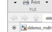
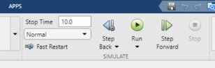
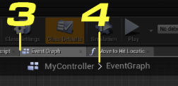
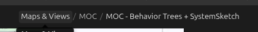

# Zach feedback — 04 September 2026

This note preserves the decisions made while reviewing the editor-chrome
dictionary at commit `3caa496`. It is evidence of the report's evolution, not a
new requirements corpus. The [current report](../../labview-blueprint-simulink-vocabulary-controls-gap-analysis-2026-09-03.html)
incorporates the dispositions below; the [revision-history hub](index.html)
keeps every earlier report available unchanged.

## Vocabulary decisions

| Concept | Zach's decision | Incorporated disposition |
|---|---|---|
| Named record projection | Split already does this. | Kept in **Already have**. |
| Named partial record update | The designed Set attributes shape should become a stock Block. | Kept in **Missing, would be useful**, marked approved for implementation. |
| Conditional value selection | A three-input Select corresponding to Python's conditional expression is useful. | Kept useful and marked approved. |
| Exceptions / railway outcomes | These are ordinary data, not top-edge mutation effects. | Moved to **Missing, would not be useful** as a bespoke rail; Error remains an optional semantic role. |
| Events | Events are ordinary data with semantic meaning, not a second wire/execution system. | Bespoke dispatch/event wires remain excluded. |
| State/configuration | These are data types/roles; a derived statechart is out of scope. | State-machine overlay remains excluded. |
| Async | The dashed direct wire is the right grammar; do not invent a junction. | Useful work is limited to source proof and explanation of the existing dashed edge. |
| Trigger / clock | A visible Clock/Trigger source with an explicit rate or source is useful. | Kept useful and marked approved. |
| Semantic roles | Tag a port once; connected wires should inherit the role automatically. | V1 is port-authored and wire-derived. `Data` is implicit; Event, Configuration, State, Control, and Error are optional labels on the same dataflow. |

## UI and application-chrome decisions

| Concept | Zach's decision | Incorporated disposition |
|---|---|---|
| Required/default/override cues | SystemSketch already makes empty, defaulted, and wired inputs readable; keyword-only alone is not interesting. | Kept in **Already have**; standalone keyword/recommended badges remain excluded. |
| Contextual source/provenance | A nearby Inspector can explain provenance, link documentation, and show uses. | Kept useful and approved; implementation belongs with trustworthy source facts. |
| Source project/definition/occurrence navigator | Useful once pyblocks connects the board to real Python. | Kept useful but explicitly staged for the pyblocks/source-index phase. |
| Semantic Find References | Reasonable as an identity-aware filter/search surface, though not yet a priority. | Kept useful and staged behind the same source index. |
| Source-linked Problems actions | Useful, but later with pyblocks/source navigation. | Kept useful and staged behind real source spans. |
| Stable right-dock tabs | This is a presentation choice; FigJam-like transient surfaces are acceptable for now. | Kept as a deferred UI option, not a prerequisite. |
| Landmarks / saved views | Potentially useful for jumping to named visual presentations. | Kept as a future presentation feature. |
| Breadcrumb and Back/Forward navigation | Strongly approved for a prototype. Higher-level crumbs must be selectable, the top-level system stays visible, and depth is instantly legible. | Kept useful and marked approved. Breadcrumbs compose with Step In/Out: crumbs/Up express structure while Back/Forward replay chronological visits. |
| Component-interface lens | Port view already hides internals and shows the interface. | Moved to **Already have**; no second interface lens is proposed. |
| Propagation focus | Highlight a chosen cable/value forward or backward by a bounded number of steps. | Reframed from a static hierarchy table into an approved, non-mutating focus command over the real graph. |
| Board-wide semantic table | Likely confusing; skip for now. | Moved to **Missing, would not be useful** for this product phase. |
| Run / Pause / Stop | Useful for an explicit runtime adapter. | Kept useful and approved, conditional on a real adapter contract. |
| Record / trace / playback | Useful as transient execution evidence. | Kept useful and approved for a recorded-trace phase. |
| Live/read-only probes | Useful when backed by a run or trace. | Kept useful and approved, never as authorable board state. |
| Behavior trees | Research separately. | Kept outside this report and implementation batch. |

## Feedback image evidence

These four crops were supplied by Zach during review. They preserve what was
being discussed; they are **not** substitutes for the official vendor evidence
under dictionary entries.

### Simulink editor navigation

The relevant precedent is structural/editor navigation. It is separate from
the execution transport shown in the next crop.

### Simulink execution transport

`Step Back` and `Step Forward` under **SIMULATE** concern runtime execution, not
editor visit history. The current report keeps these concepts in separate rows.

### Blueprint graph breadcrumb

### Obsidian breadcrumb

The Blueprint and Obsidian crops reinforce the chosen structure: retain the
top-level identity, expose every ancestor as a direct jump, and keep navigation
history orthogonal to hierarchy.

## Obsidian handoff

The history hub and every revision are ordinary repository Markdown/HTML, so a
future vault-scoped task can add one durable Obsidian note linking this lineage
without copying the research. This code-repository task intentionally does not
write into `/home/bam/zach_brain`.
