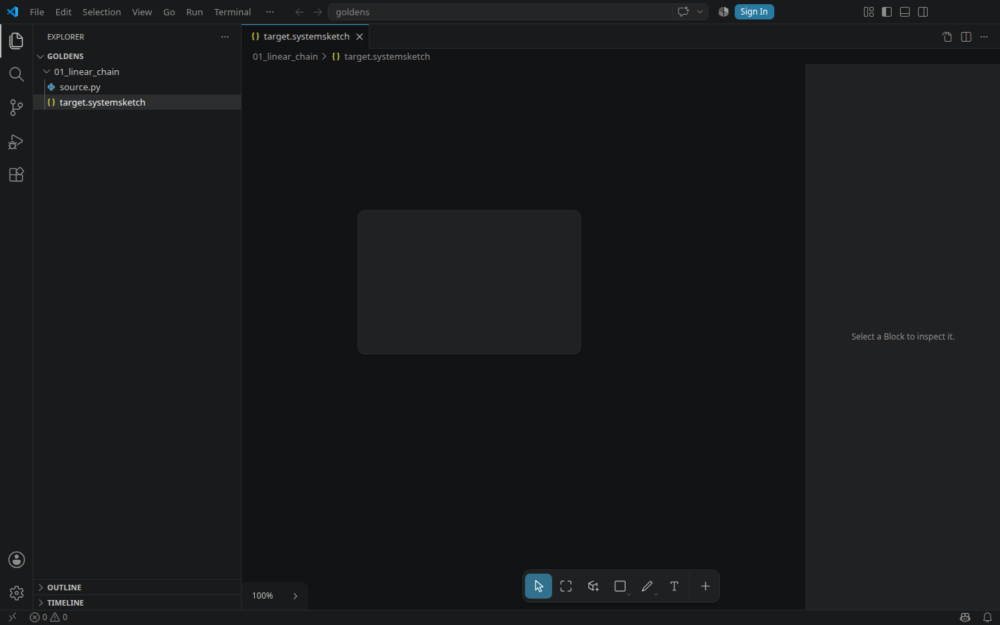

# SystemSketch for VS Code and Cursor

Open a `.systemsketch` or `.tldr` file from the file tree and the SystemSketch canvas
appears in the editor pane. Draw, press <kbd>Ctrl</kbd>+<kbd>S</kbd>, and the file on disk
is what changed.



## What it is, and what it deliberately is not

The extension is a **file viewer and editor**, nothing more. It ships a build of the
SystemSketch app and hands it whichever file the IDE opened.

It contributes **no** New, Open, Save As, rename, recents or workspace browser, and the
embedded canvas hides the app's own versions of those. The tree on the left already does all
of it, better, and a second file manager inside an editor pane is only a place for the two to
disagree. What stays is everything that edits a *board*: the toolbar and Block tool, the
right-click menu, the inspector, ports, cables, depth navigation.

The IDE owns the document. A canvas edit marks the tab dirty and writes nothing until you
save; undo, split view, diffs and source control all work because there is only ever one
document model — VS Code's.

## Install

```bash
cd ~/systemsketch/vscode-systemsketch && npm install && npm run package
```

Then install `dist/systemsketch-vscode-0.1.0.vsix` from the Extensions view
(**⋯ → Install from VSIX…**), or:

```bash
code --install-extension ~/systemsketch/vscode-systemsketch/dist/systemsketch-vscode-0.1.0.vsix --force
```

Cursor takes the same VSIX — it is a VS Code fork using the identical custom-editor API.

## Which build it ships

`npm run package` stages the **Stable** release, and refuses to build a VSIX from anything
else. Stable is the immutable build you verified with `npm run release:promote`; an installed
extension is long-lived, so it must not quietly carry working-tree work.

The staged app records what it is in `dist/app/app.json`, and
**SystemSketch: Show Bundled Build** reads it back out, so what is installed is always
identifiable. Two things can disqualify a tree from being Stable, and both are checked:
the release's recorded `sourceRoot` must be this checkout (a track worktree is never Stable,
no matter what its file timestamps say), and its source must not have moved since.

For day-to-day work on the extension itself, `npm run build` and `npm run package:dev` stage
whatever is in the tree and stamp it `"channel": "development"`.

## Proof

```bash
cd ~/systemsketch/vscode-systemsketch && npm test
```

That installs the VSIX into a throwaway profile, launches real VS Code under Xvfb, and drives
it over CDP — opening a blank golden target from the tree, clicking the Block tool, drawing,
saving, reopening, and reading the bytes that landed on disk. Ten checks; the oracle for
every one is either the workbench's own DOM or the file itself.

`CODE_PATH=/usr/bin/cursor npm test` runs the same journey in Cursor. A fresh Cursor profile
shows a sign-in wall over its workbench, so the suite reports the eight checks it can reach
there and names the two it cannot, rather than failing or pretending.

To prove every PyBlocks golden opens through the packaged extension, run the corpus sweep:

```bash
SYSTEMSKETCH_CORPUS_ROOT=~/pyblocks/examples/systemsketch_goldens npm run test:corpus
CODE_PATH=/usr/bin/cursor SYSTEMSKETCH_CORPUS_ROOT=~/pyblocks/examples/systemsketch_goldens npm run test:corpus
```

It copies the corpus and installs the freshly built VSIX into disposable directories, opens
each unique `target.systemsketch` and `generated.systemsketch` path, verifies the canvas and
Block toolbar with no embed error, closes the editor, and proves that opening changed no
bytes. If Cursor's first-run sign-in wall prevents Quick Open, the result is explicitly
`blocked`; it is never reported as a corpus pass.

## How it works

Three files, and one rule each.

| | |
|---|---|
| `src/extension.ts` | A `CustomTextEditorProvider`. Knows about files and versions; knows nothing about Blocks. |
| `scripts/stage_app.mjs` | Builds the app with `--base ./` into `dist/app/` and stamps its provenance. Relative asset URLs are load-bearing: a webview is served from an opaque origin, so vite's default `/assets/…` resolves against nothing. |
| `esbuild.config.mjs` | Bundles the extension host only. The webview is the app's own vite output — never a second build of the canvas. |

The webview loads the staged `index.html` with a `<base>`, a per-panel CSP nonce, and one
injected script that installs the host bridge *before* the app runs. That ordering is why
`App.tsx` can decide it is embedded on its first render instead of mounting the workspace app
and tearing it down.

Everything the two sides agree on — the `.systemsketch` envelope, the suffix rules, the
message types — lives in [`src/embed/sharedWithHost.ts`](../src/embed/sharedWithHost.ts), and
`tests/test_stock_boundary.py` asserts that is the only thing an extension imports from the
app. Anything a host reaches past it becomes a second, invisible build of that code.

## The `.systemsketch` file

A tldraw file with one extra top-level `systemSketch` key in front of it, carrying an
inventory of what the document holds. Reading strips the key; a `.tldr` has none to strip and
travels the identical path untouched. The suffix — and only the suffix — decides whether the
envelope is written back, which is why the same editor can own both types without ever
silently converting one into the other.

An empty file is a blank board, not a parse error. That is what makes a freshly seeded golden
`target.systemsketch` something you can click and start drawing in.
